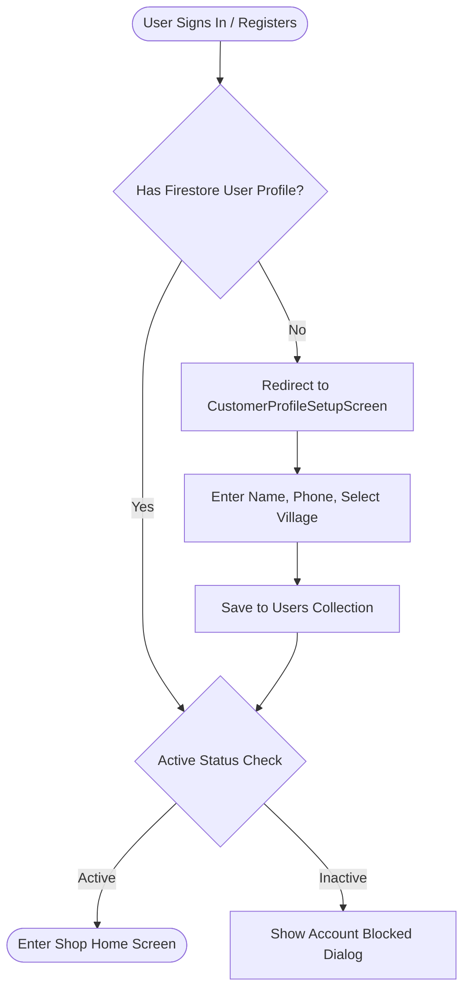
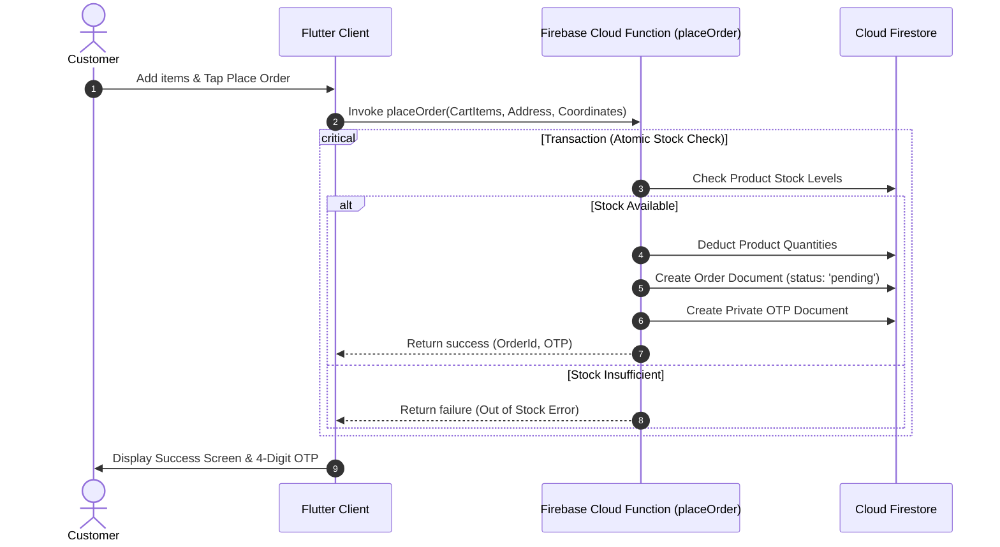
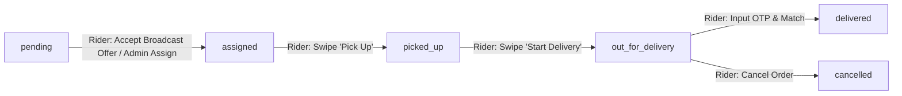

# HyperMart Hyperlocal Commerce Platform - Comprehensive Status & Design Manual

This document details the tech stack, data models, backend cloud functions, **detailed UI/UX layouts, design flows, premium animation/transition ideas, and structural diagrams** for the HyperMart Hyperlocal Commerce Platform (J C Mart).

---

## 1. Tech Stack & Environment

- **Frontend**: Flutter (v3.7.0+), Dart SDK (^3.7.0)
- **State Management**: Provider (v6.1.2) using `ChangeNotifier` and `ChangeNotifierProxyProvider` for cross-provider synchronizations.
- **Backend & Database**: Firebase (Auth, Firestore, Cloud Functions).
- **Assets & Media**: CachedNetworkImage (v3.4.1), FlutterSvg (v2.0.10), and Cloudinary integrations.
- **Maps & Location**: Geolocator (v14.0.2), FlutterMap (v8.3.1), and LatLong2 (v0.10.1).

---

## 2. Directory & Package Structure

```
hypermart/
├── functions/                     # Firebase Cloud Functions (TypeScript)
│   ├── src/
│   │   └── index.ts               # Core callable and trigger functions
│   └── seed.js                    # Database seeder script
├── lib/
│   ├── app.dart                   # Root MaterialApp and router configuration
│   ├── main.dart                  # App initialization and MultiProvider registrations
│   ├── core/                      # Global models, services, and shared providers
│   │   ├── design/                # App design tokens, icons, and theme values
│   │   ├── models/                # Base data models (UserModel, AddressModel)
│   │   └── providers/             # Core providers (AuthProvider, CartProvider, OrderProvider, ProfileProvider)
│   ├── data/                      # Data sources and repository implementations
│   │   └── repositories/          # Firebase repositories (Auth, Order, Product)
│   ├── domain/                    # Clean Architecture domain logic
│   │   ├── entities/              # Core business entities (Order, Product)
│   │   ├── repositories/          # Abstract repository interfaces
│   │   └── usecases/              # Clean usecase queries (verify delivery, assign rider)
│   └── modules/                   # Feature modules
│       ├── admin/                 # Administrator Console tab interfaces
│       ├── auth/                  # Unified role selection and signup screens
│       ├── customer/              # Customer shopping, checkout, and tracking screens
│       ├── delivery/              # Delivery rider dashboard (Tasks tab)
│       └── profile/               # Profile dashboard, editing dialogs, and shimmers
└── test/                          # Automated tests suite
```

---

## 3. UI Screens Breakdown & Layout Designs

Below is the layout blueprint and element descriptions for each role's screen interface in HyperMart.

### A. Auth Module Screens

#### 1. Unified Login Screen (`UnifiedLoginScreen`)

- **Visual Design**: Sleek minimal grid backdrop, rounded card.
- **Components**:
  - Role selection cards: Administrator, Customer, and Delivery Boy. Displays selected cards with a highlighted green border.
  - Form navigation: Launches role-specific login views.

#### 2. Customer Profile Setup Screen (`CustomerProfileSetupScreen`)

- **Visual Design**: Mandatory onboarding page (hides standard back buttons to force profile completeness).
- **Elements**:
  - Person pin graphic header.
  - TextFormField for Customer Name (capitalizes words, validates non-empty).
  - TextFormField for Mobile Number (numeric keyboard, length $\ge$ 10).
  - Custom `VillageDropdown` selection for package routing.
  - "Save & Continue" custom loading button.
  - "Cancel & Sign Out" link in red.

---

### B. Customer Module Screens

```
+-------------------------------------------------+
|   J C Mart  (Deliver to: Bhimavaram)        |
|                                                 |
|   [ Search fresh produce, dairy...           ]  |
|                                                 |
|   [All]  [Fruits & Veg]  [Dairy & Eggs]  [Bakery]  <- Category Chips
+-------------------------------------------------+
|                                                 |
|   +-------------------+   +-------------------+ |
|   |    Fresh Apple    |   |    Fresh Milk     | |
|   |                   |   |                   | |
|   |    1 kg - ₹120    |   |    500ml - ₹30    | |
|   |                   |   |                   | |
|   |      [ ADD ]      |   |    [-]  2  [+]    | |
|   +-------------------+   +-------------------+ |
|                                                 |
|                [ Cart (2) • ₹180 ]              |
+-------------------------------------------------+
```

#### 1. Customer Home Screen (`CustomerHomeScreen`)

- **Navigation**: Modern **Floating Bottom Navigation Bar (`FloatingNavbar`)** occupying **~70% screen width**, horizontally centered with pill animations, micro-shadows, and safe area floating bounds.
- **Tabs**:
  - **Shop Tab**: Header showing current delivery village/phone. Search field with pill-shape borders. Horizontal list of category choice chips. Dual-column `GridView` of product cards with instant quantity steppers. Top right header profile avatar navigates directly to `UserProfileScreen`.
  - **Cart Tab** (wired to `CartScreen`): Lists added products with persistence across app restarts (`SharedPreferences` + Firebase Cloud Sync). Shows delivery thresholds and navigates to `CheckoutScreen`.
  - **Orders Tab** (wired to `OrderHistoryScreen`): Lists active and completed order cards with real-time status updates.
- **Cart Summary Overhang**: Floating sticky bottom bar showing cart item count and total checkout preview when active.

#### 2. Dedicated Checkout Screen (`CheckoutScreen`)

- **Visual Design**: Sleek checkout review page with 20-minute delivery guarantee banner.
- **Elements**:
  - ⚡ **20-Min Flash Delivery Banner**: Prominent green gradient express delivery guarantee.
  - **Delivery Contact & Location Card**: Formatted customer name/phone, saved address selector, custom address input, and interactive map pinning via `LeafletLocationPicker`.
  - **Order Items Summary**: Product thumbnails, quantities, price breakdown, and medicine prescription warnings.
  - **Special Delivery Instructions**: Text field for rider delivery notes.
  - **Payment Selection**: Radio selectors for Cash on Delivery (COD) and Scan & Pay via UPI on Arrival.
  - **Detailed Bill Breakdown**: Items Subtotal, Delivery Fee (Free delivery threshold handling), Taxes & Packaging Fee (₹5), and Grand Total.
  - **Swipe-to-Confirm Slider**: `SwipeToConfirmSlider` widget requiring explicit swipe action to place order.

#### 3. Order Tracking Screen (`OrderTrackingScreen`)

- **Visual Design**: Real-time status roadmap showing visual progress milestones.
- **Elements**:
  - Order details card: total cash collection, rider name, contact link.
  - Roadmap tiles: "Order Placed" $\rightarrow$ "Rider Assigned" $\rightarrow$ "Picked Up" $\rightarrow$ "Out for Delivery" $\rightarrow$ "Delivered". Icons change to green checkmarks as status updates.
  - Large secure **Delivery OTP** card display: _"Give this OTP to the rider: XXXX"_.

---

### C. Delivery Rider Screens

#### 1. Delivery Home Screen (`DeliveryHomeScreen`)

- **Header**: Rider panel title, active rider name, and log out icon.
- **Tabs**:
  - **Active Tasks**: Lists assigned orders. Cards display customer details, call button, navigate button (triggers maps redirect), cash total collection banner, and state transition buttons.
  - **Completed Runs**: List of delivered/cancelled orders with leading check/close badges.

#### 2. OTP Verification Dialog (`_showOtpVerificationDialog`)

- **Visual Design**: Centered alert dialog with a password-style textbox.
- **Components**:
  - Large text field with auto-spaced character layouts.
  - Real-time verifying loader.
  - Error message display.

---

### D. Administrator Console Dashboard

#### 1. Admin Home Screen (`AdminHomeScreen`)

- **Structure**: Multi-tab layout for business operations.
- **Tabs**:
  - **Order Management**: Lists all orders in Firestore. Displays manual rider assignment drawers.
  - **Inventory Catalog**: Grid of catalog items. Tapping opens a bottom sheet to add stock, edit prices, delete items, or add new products.
  - **Delivery Partners**: Shows list of active riders. Displays toggles for active status and button to add new riders.

---

### E. Unified Profile Screen (`UserProfileScreen`)

- **Header Banner**: Parallax gradient banner from green to deep teal. Custom circular avatar with camera overlay trigger.
- **Account Details**: Email address, phone, and village details cards.
- **Addresses Hub**: List of saved addresses with trailing delete buttons. Tapping "Add" opens a form dialog.
- **App Preferences**: Theme selection dropdown (Light/Dark/System), and push notifications toggle.
- **Actions**: Logout button with red borders.

---

## 4. Key Design Ideas, Animations & Transitions

To elevate HyperMart into a premium, state-of-the-art app, we propose the following animations and transition features:

### A. Swipe-to-Confirm Slider (Rider Task Updates)

Instead of standard buttons, riders confirm task milestones using a **swipe-to-confirm** action track (like Uber Eats or DoorDash).

- **Interaction**: The rider drags a circular icon along a horizontal path.
- **Animation**: The arrow pulse-glows to indicate direction. If released halfway, a spring animation snaps the handle back to the start.
- **Feedback**: A brief device haptic vibration triggers upon successful completion, followed by a sliding transition to the next state.

### B. Auto-Focus OTP Input Grid

Enhance the OTP delivery verification popup with a secure, custom 4-digit digit grid.

- **Interaction**: The keyboard opens automatically. Focus hops to the next field as digits are entered, and goes back when backspace is pressed.
- **Animation**: If an invalid OTP is entered, a spring shake animation shakes the text fields, colored in deep red.

### C. Shimmer Skeleton Loading Placeholder

Prevent visual jar during Firestore loading states by rendering skeleton wrappers matching screen card dimensions.

- **Visual**: Linear gradients shifting from light grey to white in a loop.

### D. Parallax Scroll Header

Profiles and product detail screens use a parallax banner.

- **Interaction**: Swiping up shrinks the banner image into the app bar. Swiping down stretches the banner gradient dynamically.

---

## 5. System Architectural Diagrams & Flows

### A. Customer Onboarding & Profile Setup Flow



### B. Order Transaction & Checkout Flow



### C. Delivery Lifecycle & Action Transitions



---

## 6. Database Collections & Field Details

### `users`

- `name` (String), `email` (String), `phone` (String), `village` (String), `role` ("customer"), `isActive` (Boolean), `createdAt` (Timestamp), `avatarUrl` (String), `addresses` (Array of Map).

### `deliveryBoys`

- `uid` (String), `name` (String), `email` (String), `phone` (String), `village` (String), `role` ("delivery"), `isActive` (Boolean), `createdAt` (Timestamp), `avatarUrl` (String).

### `admins`

- `name` (String), `email` (String), `phone` (String), `role` ("admin"), `isActive` (Boolean), `createdAt` (Timestamp).

### `products`

- `name` (String), `description` (String), `price` (double), `stock` (int), `unit` (String), `category` (String), `imageUrl` (String).

### `orders`

- `customerId` (String), `customerName` (String), `customerPhone` (String), `deliveryAddress` (String), `village` (String), `latitude` (double), `longitude` (double), `status` (String), `totalAmount` (double), `items` (Array of Map), `deliveryBoyId` (String), `deliveryBoyName` (String), `deliveryBoyPhone` (String), `createdAt` (Timestamp), `updatedAt` (Timestamp).
- Subcollection: `private/delivery` -> `otp` (String).

---

## 7. Automated Testing & Verification Suitefsj

- **Test Path**: [customer_flow_test.dart](file:///c:/Users/gurun/Documents/PROJECTS/hota-projects/hypermart/test/customer_flow_test.dart)
  - Simulates customer cart updates.
  - Verifies quantity increments, pricing updates, and navigation status checks.
- **Codebase Integrity**: Running `flutter analyze` verifies zero compilation, type-safety, or syntax issues across all files.
