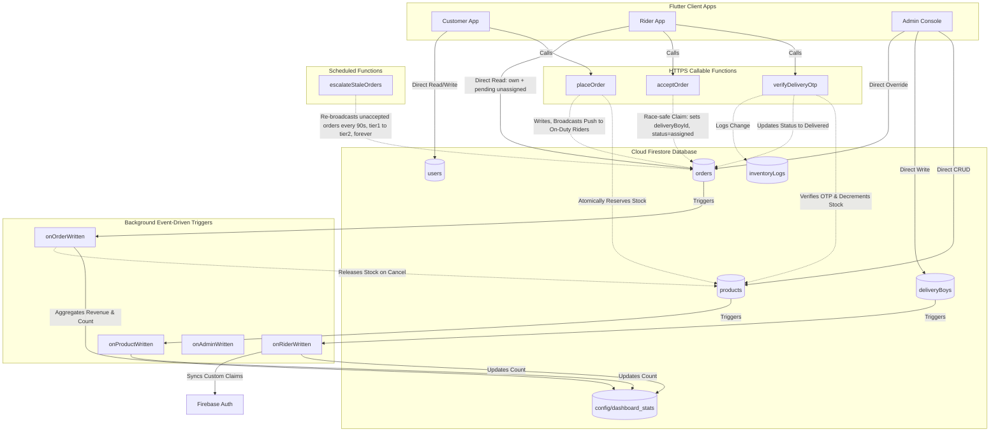

# HyperMart API Contract & Database Schema Documentation

This document defines the interface specifications, payloads, data types, authentication scopes, validation constraints, and system behaviors for the **HyperMart** (J C Mart) Hyperlocal Commerce platform.

---

## System Architecture Overview

HyperMart utilizes a serverless Firebase architecture with a hybrid communication model:
1. **HTTPS Callable Functions (V2)**: Custom backend business logic requiring high security, database transactions, and strict validation (e.g., placing orders with stock reservations and validating OTPs).
2. **Direct Firestore SDK Access**: Real-time read/write syncing with role-based document access controlled via Firestore Security Rules.
3. **Background Cloud Functions**: Event-driven listeners responding to Firestore document mutations (create, update, delete) to maintain aggregate dashboard stats and update Custom Auth claims.



---

## 1. HTTPS Callable Cloud Functions (V2)

All functions are deployed to the **Mumbai region (`asia-south1`)** to minimize latency for the hyperlocal service area.

### A. `placeOrder`
Places a Cash-on-Delivery (COD) order, checks and reserves stock levels, and generates a delivery verification OTP inside an atomic database transaction.

* **Trigger Protocol**: HTTPS Callable (`onCall`)
* **Endpoint Key**: `placeOrder`
* **Authentication**: Required (`request.auth.uid` must be populated). The user's account must exist in `users` and have `isActive === true`.
* **State Updates**:
  1. Checks if `config/app` -> `storeOpen` is `true`.
  2. Resolves product pricing, delivery fees, and free shipping limits server-side.
  3. Deducts items from `products/{id}/availableStock` and adds to `reservedStock` (updates fallback field `stock` in sync).
  4. Generates a random 4-digit OTP.
  5. Writes order document to `orders/{orderId}`.
  6. Writes verification data to `orders/{orderId}/private/delivery` (accessible only to ordering customer).

#### Request Payload
```json
{
  "items": [
    {
      "productId": "prod_12345",
      "quantity": 2
    }
  ],
  "deliveryAddress": "1-23, Main Road, Bhimavaram",
  "latitude": 16.5449,
  "longitude": 81.5212
}
```

| Field Name | Type | Required | Constraints / Validation |
| :--- | :--- | :--- | :--- |
| `items` | Array | Yes | Non-empty. Max 50 distinct items. Duplicate product IDs are rejected. |
| `items[].productId` | String | Yes | Must correspond to an active product. |
| `items[].quantity` | Integer | Yes | Range: `[1, 99]`. |
| `deliveryAddress` | String | Yes | Non-empty, max 500 characters. |
| `latitude` | Double | No | Must be a valid coordinate if provided. |
| `longitude` | Double | No | Must be a valid coordinate if provided. |

#### Response Payload
```json
{
  "orderId": "ORD_xyz987abc",
  "otp": "4820",
  "subtotal": 240.0,
  "deliveryFee": 30.0,
  "totalAmount": 270.0
}
```

#### Expected Error Codes
* `unauthenticated`: Missing user authentication.
* `permission-denied`: The user's account is marked deactivated (`isActive === false`).
* `failed-precondition`: Complete profile details are missing in `users/{uid}`, the store is closed, or requested item quantity exceeds available stock.
* `invalid-argument`: Empty cart, invalid item parameters, duplicate items, or missing delivery address.
* `not-found`: One or more products do not exist in the catalog.

---

### B. `verifyDeliveryOtp`
Verifies the customer's delivery OTP. If matched, it commits the physical stock deduction, releases the reservation, logs the transaction in the inventory ledger, and changes the order status to `delivered`.

* **Trigger Protocol**: HTTPS Callable (`onCall`)
* **Endpoint Key**: `verifyDeliveryOtp`
* **Authentication**: Required. The caller's UID must match `orders/{id}/deliveryBoyId` (Assigned Rider).
* **State Updates**:
  1. Inspects the secret in `orders/{id}/private/delivery`.
  2. Increments `attempts` by `1` on a mismatch.
  3. After 5 incorrect attempts, locks out further verification.
  4. On successful verification, updates `orders/{id}/status` to `delivered`.
  5. Updates product inventory: reduces `physicalStock` and `reservedStock` (leaves `availableStock` and `stock` matching the post-sale balance).
  6. Writes a "sale" transaction record to `inventoryLogs`.

#### Request Payload
```json
{
  "orderId": "ORD_xyz987abc",
  "otp": "4820"
}
```

| Field Name | Type | Required | Constraints / Validation |
| :--- | :--- | :--- | :--- |
| `orderId` | String | Yes | Must be a valid order ID assigned to the caller. |
| `otp` | String | Yes | Must be a 4-digit numeric string (`/^\d{4}$/`). |

#### Response Payload
```json
{
  "success": true
}
```

#### Expected Error Codes
* `unauthenticated`: Missing authentication credentials.
* `invalid-argument`: Missing order ID or incorrectly formatted OTP.
* `not-found`: The order record does not exist.
* `permission-denied`: The caller is not the assigned rider, or the OTP is incorrect.
* `failed-precondition`: The order status is not `out_for_delivery`.
* `resource-exhausted`: 5 or more incorrect OTP attempts have been made; requires Admin manual override.
* `internal`: Internal data state is missing (e.g., OTP document not generated).

---

### C. `acceptOrder`
Blinkit-style order claim: any on-duty, active rider may self-accept a `pending`, unassigned order. This is the **only** normal path by which `deliveryBoyId` gets set on an order — there is no separate admin "assign rider" callable; admins may still directly write `deliveryBoyId`/`status` on the order document as a manual override, but that bypasses this function's on-duty/active checks entirely.

* **Trigger Protocol**: HTTPS Callable (`onCall`)
* **Endpoint Key**: `acceptOrder`
* **Authentication**: Required. Caller must carry the `delivery` custom claim, and their live `deliveryBoys/{uid}` document must have `isActive !== false` and `onDuty === true` (re-checked server-side, not trusted from a possibly-stale claim).
* **State Updates**:
  1. Reads the order inside a transaction; if `status !== 'pending'` or `deliveryBoyId` is already set, returns a `"taken"` outcome (no write).
  2. Otherwise sets `status: 'assigned'`, `deliveryBoyId`, `deliveryBoyName`, `deliveryBoyPhone`.
  3. The resulting `pending` → `assigned` transition is picked up by the `onOrderWritten` trigger, which pushes a "New delivery assigned" notification to the rider and an "Order confirmed" notification to the customer.

#### Request Payload
```json
{
  "orderId": "ORD_xyz987abc"
}
```

| Field Name | Type | Required | Constraints / Validation |
| :--- | :--- | :--- | :--- |
| `orderId` | String | Yes | Must reference a `pending`, unassigned order. |

#### Response Payload
```json
{
  "success": true
}
```

#### Expected Error Codes
* `unauthenticated`: Missing user authentication.
* `permission-denied`: Caller lacks the `delivery` claim, or their rider profile is deactivated.
* `failed-precondition`: The order was already accepted by another rider (race lost), or the rider is not currently on-duty.
* `not-found`: The order record does not exist.

---

### D. `escalateStaleOrders` *(Scheduled Function, not callable)*
Runs every minute. Finds `pending`, unassigned orders whose `notifiedAt` is older than `BROADCAST_RETRY_SECONDS` (90s) and re-broadcasts them to the full on-duty rider pool, bumping `notifyTier` to 2. This is what escalates a village-scoped (tier 1) broadcast that nobody took, and what keeps re-pinging a tier-2 order indefinitely — there is no terminal "give up" state and no fallback to manual admin assignment.

* **Trigger Protocol**: `onSchedule` (`every 1 minutes`)
* **Region**: `asia-south1`
* **Side Effects**: Sends push notifications; writes `notifyTier: 2, notifiedAt: <now>` to each stale order. No client-callable surface.

---

### E. `createRiderLogin`
Creates a delivery partner auth login and registers them in the `deliveryBoys` collection with their custom auth claims initialized.

* **Trigger Protocol**: HTTPS Callable (`onCall`)
* **Endpoint Key**: `createRiderLogin`
* **Authentication**: Required. Caller must be an active admin (`admins/{uid}` exists and `isActive !== false`).
* **State Updates**:
  1. Creates a new authentication login record using Firebase Admin Auth.
  2. Sets custom user claims `{ role: "delivery", delivery: true }` on the new user ID.
  3. Inserts a new profile document in `deliveryBoys/{riderUid}` containing the metadata and whitelisted status.

#### Request Payload
```json
{
  "name": "Ramesh Kumar",
  "email": "ramesh@example.com",
  "phone": "9876543210",
  "village": "Bhimavaram",
  "password": "temporary_password",
  "vehicleNo": "AP 39 XX 1234",
  "licenseNo": "AP-39-2026-0012345"
}
```

| Field Name | Type | Required | Constraints / Validation |
| :--- | :--- | :--- | :--- |
| `name` | String | Yes | Must be a non-empty name. |
| `email` | String | Yes | Must be a valid email format. |
| `phone` | String | Yes | Must be a 10-digit numeric string. |
| `village` | String | Yes | Must be a valid logistics village name. |
| `password` | String | Yes | Must be at least 6 characters in length. |
| `vehicleNo` | String | No | Must match vehicle plate pattern if provided. |
| `licenseNo` | String | No | Must match licensing pattern if provided. |

#### Response Payload
```json
{
  "success": true,
  "uid": "new_rider_auth_uid"
}
```

#### Expected Error Codes
* `unauthenticated`: Missing user authentication.
* `permission-denied`: Caller is not an active whitelisted administrator.
* `invalid-argument`: Missing required parameters or password too short.
* `already-exists`: An auth account with the provided email is already registered.

---

### F. `sendTestPush` *(Admin utility)*
Sends a one-off test push notification to a customer's or rider's registered devices, so push delivery can be verified from the Firebase console without walking a real order through its full lifecycle. Admin-only.

* **Trigger Protocol**: HTTPS Callable (`onCall`)
* **Endpoint Key**: `sendTestPush`
* **Authentication**: Required. Caller must be an active admin.
* **Request**: `{ targetUid, collection: "users" | "deliveryBoys", title?, body? }`
* **Expected Error Codes**: `unauthenticated`, `permission-denied` (not an active admin), `invalid-argument` (missing `targetUid`), `failed-precondition` (target has no registered devices).

### G. `getCloudinarySignature` *(Admin utility)*
Computes a signed Cloudinary upload signature server-side so the API secret never ships inside the client binary. Used for product photo and banner image uploads. Admin-only.

* **Trigger Protocol**: HTTPS Callable (`onCall`)
* **Endpoint Key**: `getCloudinarySignature`
* **Authentication**: Required. Caller must be an active admin.
* **Response**: `{ timestamp, signature, apiKey, cloudName, folder }`
* **Expected Error Codes**: `unauthenticated`, `permission-denied` (not an active admin).

---

## 2. Cloud Firestore Database Schemas

Firestore collections represent data endpoints accessed by the client SDK. The database enforces the following schema structures:

### A. `users` (Customers)
* **Path**: `/users/{uid}`
* **Description**: Custom details and address book for registered customer accounts.

```typescript
interface AddressModel {
  id: string;              // Unique identifier (UUID or timestamp)
  name: string;            // Address label (e.g., "Home", "Work")
  addressLine1: string;
  addressLine2?: string;   // Optional
  pinCode: string;
  village: string;
  mandal: string;
  landmark?: string;       // Optional
  latitude?: number;       // Optional
  longitude?: number;      // Optional
}

interface UserModel {
  name: string;
  email: string;
  phone: string;
  village: string;
  role: "customer";
  isActive: boolean;
  createdAt: Timestamp;
  avatarUrl?: string;      // Optional
  addresses: AddressModel[];
}
```

### B. `deliveryBoys` (Riders)
* **Path**: `/deliveryBoys/{docId}` (or `/deliveryBoys/{uid}` after onboarding)
* **Description**: Whitelisted delivery riders. The document ID matches the rider's authentication UID after their initial login.

```typescript
interface DeliveryBoyModel {
  uid: string;             // Authentication UID
  name: string;
  email: string;           // Whitelisted email address (lowercase, trimmed)
  phone: string;
  village: string;
  role: "delivery";
  isActive: boolean;       // Active toggle
  vehicleNo?: string;
  licenseNo?: string;
  createdAt: Timestamp;
  updatedAt?: Timestamp;   // Populated on edit
  isDeleted?: boolean;     // Soft-delete flag
  deletedAt?: Timestamp;
}
```

### C. `admins`
* **Path**: `/admins/{uid}`
* **Description**: Whitelisted administrator profiles.

```typescript
interface AdminModel {
  name: string;
  email: string;           // Whitelisted email address (lowercase, trimmed)
  phone: string;
  role: "admin";
  isActive: boolean;
  createdAt: Timestamp;
}
```

### D. `products`
* **Path**: `/products/{productId}`
* **Description**: Store catalog items and inventory trackers.

```typescript
interface ProductModel {
  name: string;
  description: string;
  price: number;           // Unit cost in INR (Double)
  stock: number;           // Legacy fallback sync. Equal to availableStock.
  unit: string;            // Unit descriptor (e.g., "1 kg", "500ml", "1 pc")
  category: string;        // E.g., "Fruits & Veg", "Dairy & Eggs", "Bakery"
  imageUrl: string;        // CDN/Cloudinary image URL
  physicalStock: number;   // Total units physically present in storage
  reservedStock: number;   // Units locked in active orders (not yet delivered/cancelled)
  availableStock: number;  // Units open for new checkouts (physicalStock - reservedStock)
  updatedAt?: Timestamp;
  isActive?: boolean;      // Enable/disable catalog item visibility
}
```

### E. `orders`
* **Path**: `/orders/{orderId}`
* **Description**: Transaction documents tracking cart items and delivery status.

```typescript
interface OrderItem {
  productId: string;
  name: string;
  price: number;
  quantity: number;
}

interface OrderModel {
  customerId: string;
  customerName: string;
  customerPhone: string;
  deliveryAddress: string;
  village: string;
  latitude: number | null;
  longitude: number | null;
  items: OrderItem[];
  subtotal: number;
  deliveryFee: number;
  totalAmount: number;
  paymentMethod: "COD";
  status: "pending" | "assigned" | "picked_up" | "out_for_delivery" | "delivered" | "cancelled";
  deliveryBoyId: string | null;      // Assigned rider's UID
  deliveryBoyName: string | null;
  deliveryBoyPhone?: string | null;
  notifyTier?: 1 | 2;                 // Broadcast tier: 1 = village-matched on-duty riders, 2 = all on-duty riders
  notifiedAt?: Timestamp;             // Last broadcast time; escalateStaleOrders re-broadcasts past BROADCAST_RETRY_SECONDS
  rating?: number;                    // 1-5, customer-submitted, write-once
  ratingComment?: string | null;
  ratedAt?: Timestamp;
  createdAt: Timestamp;
  updatedAt: Timestamp;
}
```

#### Private Subcollection: `/orders/{orderId}/private/delivery`
Contains private verification tokens.
* **Document ID**: `delivery`
* **Fields**:
  * `otp`: String (4-digit code)
  * `attempts`: Number (Mismatch attempts counter)
  * `createdAt`: Timestamp

### F. `inventoryLogs`
* **Path**: `/inventoryLogs/{logId}`
* **Description**: Audit ledger for all manual or automated inventory shifts.

```typescript
interface InventoryLogModel {
  productId: string;
  adminId: string;         // The UID of the Admin adjusting stock, or Rider verifying OTP
  orderId?: string;        // Optional (associated with a specific purchase or cancellation)
  changeType: "sale" | "return" | "restock" | "correction";
  physicalDelta: number;   // Shift in physical inventory count
  reservedDelta: number;   // Shift in reserved count
  notes: string;           // Reason or transaction summary
  timestamp: Timestamp;
}
```

---

## 3. Background Cloud Functions (Event-Driven Triggers)

These triggers operate transparently in the background, listening to database writes to ensure consistency.

### `onOrderWritten`
* **Source Path**: `/orders/{orderId}`
* **Behavior**:
  * **On Creation (`pending`)**: Increments the database statistic `config/dashboard_stats` -> `activeOrdersCount` by `1`, and broadcasts a push notification to on-duty riders (village-matched tier 1, falling through to all on-duty riders as tier 2 if that pool is empty) — see `acceptOrder` and `escalateStaleOrders` in Section 1.
  * **On Transition to `assigned`**: Pushes a "New delivery assigned" notification to the newly-assigned rider, and an order-confirmed notification to the customer.
  * **On Transition to `cancelled`**: Atomically releases reserved stock:
    - Sets product `reservedStock = reservedStock - quantity`.
    - Recalculates `availableStock` and updates fallback `stock`.
    - Creates a `return` entry in `/inventoryLogs` documenting: `reservedDelta = -quantity`, `physicalDelta = 0`.
  * **On Transition to `delivered`**:
    - Reduces `activeOrdersCount` by `1`.
    - Increments `config/dashboard_stats` -> `completedRevenue` by the order's `totalAmount`.
  * **On Deletion**: If the order was active (neither `delivered` nor `cancelled`), decrements `activeOrdersCount` by `1`.

### `onRiderWritten`
* **Source Path**: `/deliveryBoys/{riderId}`
* **Behavior**:
  * Tracks rider registrations and deletions (ignores soft-deleted profiles where `isDeleted === true`).
  * Increments or decrements `config/dashboard_stats` -> `activeRidersCount` based on active rider updates.
  * Synchronizes authentication Custom Claims:
    - Active rider: Assigns `{ role: "delivery", delivery: true }` Custom Claim to rider UID.
    - Suspended or deleted rider: Sets Custom Claims to `null`.

### `onProductWritten`
* **Source Path**: `/products/{productId}`
* **Behavior**:
  * Monitors catalog changes.
  * Increments or decrements `config/dashboard_stats` -> `productCount` based on whether the product is newly created and active, or deactivated/deleted.

### `onAdminWritten`
* **Source Path**: `/admins/{adminId}`
* **Behavior**:
  * Synchronizes authentication Custom Claims:
    - Active Admin: Assigns `{ role: "admin", admin: true }` Custom Claim to admin UID.
    - Inactive: Clears custom claims.

---

## 4. Custom Claims & Role Security Model

HyperMart uses Firebase Auth Custom Claims to lock down security scopes. Role routing is enforced at both client and database rule levels.

| Role Type | Custom Claim | Firestore Access Restrictions | Application Actions |
| :--- | :--- | :--- | :--- |
| **Customer** | (Default / None) | Direct write permission to own profile in `/users/{uid}`. Direct read of own orders only. Read-only access to `/products`. No access to `/deliveryBoys`, `/admins`, or `/inventoryLogs`. | Can browse products, manage personal addresses, call `placeOrder`, and track own orders in real time. |
| **Delivery Rider** | `{ role: "delivery", delivery: true }` | Read-only access to `/products` and `/deliveryBoys`. Can read *any* `pending`, unassigned order (broadcast visibility), plus their own assigned orders. Read/Write access to their own assigned orders in `/orders` (can update status to `picked_up` or `out_for_delivery`). No direct write to order status `delivered` (must use `verifyDeliveryOtp`), and no direct write of `deliveryBoyId` (must use `acceptOrder`). | Can self-accept pending orders (`acceptOrder`), update task status, invoke `verifyDeliveryOtp` to complete tasks, and toggle on-duty status. |
| **Administrator**| `{ role: "admin", admin: true }` | Full read/write access to all collections: `/products`, `/orders`, `/users`, `/deliveryBoys`, `/admins`, and `/inventoryLogs`. Order writes are unrestricted by field, so this doubles as the manual-override path for status/rider assignment. | Can manage inventory (CRUD products), adjust stock counts, whitelist riders, monitor and override rider assignment, and monitor business analytics. |
