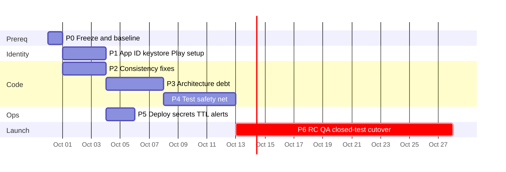

# Production Release Master Plan — J C Mart

**Created:** 2026-09-29 · **Supersedes:** [ACTION_PLAN.md](ACTION_PLAN.md) (audit-only view; this is the full build-to-release sequence)
**Inputs:** [AUDIT_REPORT.md](AUDIT_REPORT.md) · [FINDINGS.csv](FINDINGS.csv) · layer analysis (2026-09-29, ~6.5/10) · [playstore_launch_checklist.md](../playstore_launch_checklist.md) (historical — re-verify items before trusting)

**Total estimate:** ~14–18 focused dev-days across 6 phases + calendar time (Play closed-testing 14 days if new account, review cycles). Phases 2–4 can overlap; Phase 0 and 1 are strict prerequisites for everything.

**The one rule:** nothing ships until every gate in Phase 6 is green. The two irreversible items (applicationId, keystore) happen in Phase 1 or not at all.

---

## Phase 0 — Freeze & Baseline *(0.5 day, blocks everything)*

The working tree currently carries ~130 uncommitted changes (support module, checkout, App Check migration). Nothing else is safe to start until this lands.

- [ ] **0.1** Commit or stash the in-flight work on `main` (owner: you). Suggested: single commit `feat: support module, checkout, app check, hardened functions` after a quick self-review of `git diff --stat`.
- [ ] **0.2** Push and watch CI run end-to-end: `flutter analyze` → `flutter test` → functions `build`+`test` ([ci.yml](../../.github/workflows/ci.yml)). **Gate: all four jobs green.**
- [ ] **0.3** Run the functions suite locally once (`npm --prefix functions test`) to confirm the jest-mocked-admin setup still passes after recent changes.
- [ ] **0.4** Tag the baseline: `git tag baseline-2026-09`.
- **Done when:** CI green on main, tag pushed, tree clean.

## Phase 1 — Release Identity & Store Prerequisites *(2–3 days; starts the calendar clock)*

Two **irreversible** decisions live here. Do them before writing any more code.

- [ ] **1.1 Decide the final applicationId** (e.g. `com.jcmart.app`). Business decision — cannot change after first Play publish.
- [ ] **1.2 Register the Firebase Android app under that ID** → download new `google-services.json` → update [build.gradle.kts](../../android/app/build.gradle.kts) `namespace` + `applicationId` → update `firebase.json` flutter.android mapping → re-run `flutterfire configure`. Verify `lib/firebase_options.dart` agrees.
- [ ] **1.3 Generate the release keystore** (`upload-keystore.jks`), create `android/key.properties`, confirm both stay git-ignored ([.gitignore:51-53](../../.gitignore#L51-L53)). **Back the keystore + passwords up to a vault the business controls. Losing this loses the app identity.**
- [ ] **1.4 Hard-fail release signing**: replace the debug-key fallback in `build.gradle.kts` buildTypes.release with a `GradleException("key.properties missing — cannot sign release")`. **Gate: `flutter build appbundle --release` produces a signed aab; deleting key.properties makes the build fail loudly.**
- [ ] **1.5 Branding sweep**: pick one name ("J C Mart") across `AndroidManifest.xml` label, web title, in-app strings; note legacy names (blinkbasket/HyperMart/JP Mart) for the doc cleanup in Phase 2.
- [ ] **1.6 Write the privacy policy** (location, name, phone, order history, FCM tokens; Cloudinary + Firebase as processors) and host it at a public URL.
- [ ] **1.7 Play Console setup**: create the app listing, complete the **Data Safety form** (precise location, personal info, purchase history — no prescription data: that flow is unused), content rating, and start the **closed testing track** (12 testers × 14 days if this is a new developer account — start now, it's calendar time).
- **Done when:** signed aab builds under the final ID, keystore is backed up, listing + privacy policy live, closed test invites sent.

## Phase 2 — Correctness & Consistency *(2–3 days, parallelizable with Phase 1)*

All audit findings that are cheap and make the system coherent. Every item has a verification step.

- [ ] **2.1 Ledger actor key standardization (H-1, High)** — in [index.ts](../../functions/src/index.ts) replace `adminId:` with `actorId:` in all three ledger writers (`placeOrder` ~:365, `verifyDeliveryOtp`, `onOrderWritten`), keep `actorType`. The Dart DTO already reads both ([inventory_ledger_dto.dart:22](../../lib/data/models/inventory_ledger_dto.dart#L22)). Update the functions tests. **Verify: `grep -n "adminId:" functions/src/index.ts` → no ledger writes; jest green.**
- [ ] **2.2 Decide `products` read policy (L-1)** — if pre-login browsing is not a requirement, change [firestore.rules:94](../../firestore.rules#L94) `allow read: if true` → `signedIn()`. Document the decision either way in [../context/SECURITY_MODEL.md](../context/SECURITY_MODEL.md). **Verify: rules tests + manual anonymous check.**
- [ ] **2.3 Delete the dead Node-backend branch (I-2)** — remove `HttpOrderRepository`'s HTTP paths + [backend_config.dart](../../lib/core/services/backend_config.dart); wire `OrderProvider` directly to `FirebaseOrderRepository` in [main.dart:150](../../lib/main.dart#L150). **Verify: `flutter analyze` 0 issues.**
- [ ] **2.4 Seed-script consolidation (L-5)** — keep `scripts/seed.js` (emulator-oriented); delete `functions/seed.js`, `functions/seed_admin.js`, `lib/seed_main.dart` (or move to `scripts/archive/`). Update ONBOARDING.md.
- [ ] **2.5 Dead screen (L-4)** — wire `AdminProfileScreen` into the admin UI (one nav entry from admin home) or delete it + its route ([route_generator.dart:164](../../lib/core/utils/route_generator.dart#L164)).
- [ ] **2.6 Model governance** — consolidate `isAvailable` vs `isActive` on products (pick one, map the other in the DTO); document the `actorId`/`adminId` bridge and the three rider state flags (`isActive`/`isDeleted`/`onDuty`) in [../context/DATA_MODEL.md](../context/DATA_MODEL.md).
- [ ] **2.7 Hygiene (L-6, I-1)** — delete the 0-byte `firestore-debug.log` files; rewrite [README.md](../../README.md) links from `file:///c:/Users/...` to relative repo paths.
- [ ] **2.8 CLAUDE.md truth pass (M-6)** — rewrite the "Quick Commerce Guidelines" section: Provider (not Riverpod), hand-written DTOs (not Freezed), exceptions/Result (not Either). This doc drives AI agents — wrong conventions get replicated.
- **Done when:** all greps/verifications above pass; CI green.

## Phase 3 — Architecture Debt *(3–4 days; makes Phase 4 possible)*

Ordered by dependency. The goal is not beauty — it's making the controller layer testable and stopping the layering decay.

- [ ] **3.1 Purify the domain boundary (highest value)** — [auth_repository.dart:1](../../lib/domain/repositories/auth_repository.dart#L1) imports `firebase_auth`. Define domain-owned types (`AuthUser` wrapping uid/email/displayName/photoUrl; `AuthResult` already exists as your own class — keep it), map from Firebase's `User` inside `FirebaseAuthRepository`, delete the SDK import. Fix the ~10 compile sites. **Verify: `grep -rln "package:firebase\|package:cloud_firestore" lib/domain` → empty; `flutter analyze` + `flutter test` green.**
- [ ] **3.2 Route the 6 shortcut providers through interfaces** — banner, cart, config, order, product, support providers import `data/` directly. Each already receives repositories via constructor where it counts; change their field types from concrete impls to domain interfaces (constructor defaults can stay concrete). **Verify: `grep -rln "import.*data/" lib/core/providers` → empty (CartItem move first — 3.3).**
- [ ] **3.3 Move `CartItem` out of the provider** — [cart_provider.dart:10](../../lib/core/providers/cart_provider.dart#L10) → `lib/core/models/cart_item.dart` (it serializes to Firestore, so it belongs with `UserModel`).
- [ ] **3.4 Fix the 2 view-level repository constructions** — [order_history_screen.dart:255](../../lib/modules/customer/screens/order_history_screen.dart#L255), [order_tracking_screen.dart:840](../../lib/modules/customer/screens/order_tracking_screen.dart#L840) construct `FirebaseProductRepository()` inline. Hoist through `ProductProvider` (add a `getProductById` passthrough). Also fix the 7 views importing DTOs (checkout, address screens, village_dropdown, profile_setup) to use entities.
- [ ] **3.5 God-file phase 2 (M-1)** — extract from [admin_home_screen.dart](../../lib/modules/admin/screens/admin_home_screen.dart) (1,985 L): order-queue flows → `AdminOrderController` (or provider), inventory adjust → existing use case path. Target <1,200 lines now (full split can wait post-launch). **Verify: no behavior change — run the manual admin pass in 6.2.**
- [ ] **3.6 CI layer-guard (cheap, permanent)** — add a grep step to [ci.yml](../../.github/workflows/ci.yml) that fails when `lib/domain` imports firebase/cloud_firestore/flutter, or `lib/modules` imports `data/`. ~10 lines of bash; makes the architecture self-enforcing.
- **Done when:** 3.6's guard passes in CI — that's the proof.

## Phase 4 — Test Safety Net *(4–5 days, overlapping Phase 3)*

Priority order = risk order: auth first, then money paths, then rules.

- [ ] **4.1 AuthProvider role-discovery tests** (unblocked by 3.1) — fake `AuthRepository`: customer fresh sign-in → needsProfileSetup; onboarding-complete → authenticated; inactive → logout+message; rider UID-mismatch → logout; admin → home; the 5-minute token-refresh deactivation path. This is the most intricate untested client logic.
- [ ] **4.2 Cart + checkout math tests** — CartProvider totals/quantities/prune-on-load; checkout preview vs `placeOrder` contract (fee thresholds, ₹5 packaging assumption, total = subtotal + fee).
- [ ] **4.3 True Firestore rules tests (I-5)** — replace the logic-mirror suite with `@firebase/rules-unit-testing` (already a devDep) against the emulator: full order status machine (rider one-step forward, `delivered` unreachable directly, write-once rating), OTP privacy, rider self-edit allowlist, user role-escalation block, ledger admin-only.
- [ ] **4.4 Callable tests for the untested 8** — at minimum `acceptOrder` (race → "taken"), `resetOtpAttempts` (admin-only), `expireStaleOrders` (cancels stale, skips assigned), `escalateStaleOrders` (tier bump), `createRiderLogin` (password server-generated).
- [ ] **4.5 Wire Playwright into CI** — new `ci.yml` job: build web with `USE_FIREBASE_EMULATOR=true`, start emulators, `npx playwright test`. Mark `continue-on-error: false` only after 5 consecutive green runs (E2E is flaky until proven).
- [ ] **4.6 Coverage gate (soft)** — add `flutter test --coverage` + a simple % report; set a ratchet (fail only if coverage *drops*). Don't chase a number.
- **Done when:** CI runs analyze + dart tests + functions tests + rules tests (+ E2E if stabilized). Every provider has ≥1 test.

## Phase 5 — Ops & Cost Hardening *(1–2 days, mostly small)*

- [ ] **5.1 Fix the deploy pipeline (M-4)** — replace the hosting-deploy step in [deploy.yml](../../.github/workflows/deploy.yml) with a real deploy: `firebase deploy --only functions,firestore:rules,firestore:indexes,storage --project ${{ secrets.FIREBASE_PROJECT_ID }}` via `w9jds/firebase-action` or firebase-tools + service account. **Gate: push a no-op commit; workflow log shows functions deployed.** Add web hosting only if web launch is wanted.
- [ ] **5.2 Secrets verification (U-1/U-2)** — `firebase functions:secrets:access CLOUDINARY_API_SECRET` and `_KEY`; set if missing. **Rotate the Cloudinary secret** if the old client-side one may still be active. Confirm GitHub secrets exist.
- [ ] **5.3 TTL policies (M-5)** — Firestore TTL on `inventoryLogs.timestamp` (~18 months, business sign-off); decide support-message retention; note both in DATA_MODEL.md.
- [ ] **5.4 Budget + alerting** — GCP budget alert ($10–25/mo to start); Cloud Functions alert on `escalateStaleOrders` error rate; Crashlytics → email digests to the owner.
- [ ] **5.5 Scale watch-items (I-4, L-3)** — document (don't build yet) the triggers: paginate `streamAllOrders` when order count approaches 300; revisit in-memory rate limiting if multi-instance behavior matters. Add these to [../context/DEPLOYMENT.md](../context/DEPLOYMENT.md).
- **Done when:** a commit to main lands in production without human action; secrets verified; alerts firing to a real inbox.

## Phase 6 — Release Candidate & Launch *(calendar-bound)*

- [ ] **6.1 RC build & internal pass** — `flutter build appbundle --release` → internal testing track on 2+ physical devices.
- [ ] **6.2 Full manual 3-persona QA** (one pass, ~2 h, on the RC): customer order (map pin → swipe confirm → OTP display) → rider accept/pickup/deliver-with-OTP → admin dashboard counters, ledger shows one coherent `sale` entry with `actorId`, cancel + expiry paths, push notifications each step, dark mode spot-check.
- [ ] **6.3 App Check cert registration** — after the first Play upload: Play Console → App integrity → copy **Play App Signing** SHA-256 → Firebase console → App Check. **Gate: a release-build device successfully calls `placeOrder`.** (Until done, every real user is silently rejected while local debug builds work — the classic trap.)
- [ ] **6.4 Closed testing (14 days if new account)** — the Phase 1.7 track runs during Phases 2–5; collect tester feedback weekly.
- [ ] **6.5 Store listing** — 512² icon, 1024×500 feature graphic, 2–8 screenshots, descriptions; adaptive icon via `flutter_launcher_icons` (check the padded foreground — pubspec comments flag clipping risk).
- [ ] **6.6 Production cutover** — deploy functions/rules/indexes via the fixed pipeline; console-create the first real `admins/{uid}`; set `config/app` via Store Settings; verify `getCloudinarySignature` from the app; **enable Firestore PITR/backups** (console) before real orders.
- [ ] **6.7 Launch-day runbook** — smoke checklist (place order, accept, deliver, ledger, push), rollback plan (Play halo/pause + `firebase deploy` previous functions build), on-call = the owner, support numbers live in `config/app`.
- [ ] **6.8 Post-launch week 1** — daily Crashlytics review, dashboard stats sanity vs actual orders, FCM token pruning working, budget tracking.

---

## Definition of "production grade" (the bar, in one table)

| Dimension | Gate | Covered by |
|---|---|---|
| Correctness | CI fully green incl. rules tests; ledger coherent | P2, P4 |
| Security | App Check verified end-to-end on release build; secrets verified+rotated | P1, P5, 6.3 |
| Identity | Final applicationId, signed releases, backed-up keystore | P1 |
| Architecture | Domain pure; layer-guard in CI passing | P3 |
| Testability | Every provider tested; rules truly tested; E2E in CI | P4 |
| Operability | Push-to-deploy works; alerts live; backups on | P5, 6.6 |
| Store compliance | Data Safety truthful; privacy policy live; listing complete | P1, 6.5 |
| Support | Support numbers configured; owner can read Crashlytics | 6.6, 6.8 |

## Sequencing at a glance

*(Closed-testing 14 days overlaps P2–P5; the critical path is P0 → P1(1.1–1.4) → P2 → P3 → P4 → 6.2/6.3 → cutover.)*

## Plan risks
- **Play review/closed-testing calendar** can push launch 2–3 weeks regardless of dev speed — start 1.7 immediately.
- **Scope creep in P3** — timebox the god-file work; "good enough to test" beats "perfect".
- **The dirty tree** — if P0 gets deferred, every subsequent change risks entangling with the in-flight refactor.
