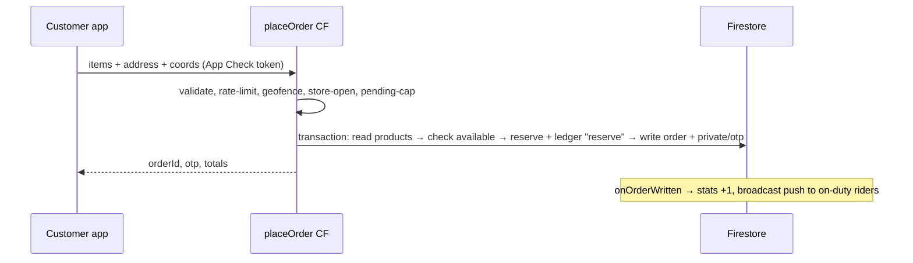

# API Contracts

## Purpose
The full callable-function surface, trigger behaviors, and Firestore-side access contract. Payloads from actual writer/reader code.

## Key facts

### Transport
All callables are Firebase `onCall` v2, region `asia-south1`, with `enforceAppCheck: true` in production (`process.env.FUNCTIONS_EMULATOR !== "true"` keeps emulator/dev usable). A shared in-memory per-UID rate limiter (20 calls/min per action, key `action:uid`) fronts every state-changing callable except `sendTestPush`/`resetOtpAttempts` ([index.ts:28-46](../../functions/src/index.ts#L28-L46)) — note it resets on instance cold-start.

### Callable functions

| Function | Caller | Input | Returns | Errors (HttpsError code) |
|---|---|---|---|---|
| `placeOrder` :247 | customer | `items[{productId, quantity}], deliveryAddress, deliveryInstructions?, latitude, longitude` (coords **required**) | `{orderId, otp, subtotal, deliveryFee, totalAmount}` | `unauthenticated`, `invalid-argument` (empty/dup items, qty 1-99, ≤50 items, addr ≤500 chars, missing coords), `failed-precondition` (geofence >12 km, store closed, no profile, stock short), `permission-denied` (deactivated), `resource-exhausted` (rate limit or ≥3 pending orders) |
| `cancelOrder` :444 | customer (owner) | `orderId, reason?` | `{success:true}` | `not-found`, `permission-denied` (not owner), `failed-precondition` (picked up or later) |
| `reportDeliveryFailure` :507 | assigned rider | `orderId, reason?` (enum: unreachable/refused/wrong address/Other) | `{success:true}` — sets `status:cancelled, cancelledBy:"rider"` | `not-found`, `permission-denied`, `failed-precondition` (delivered/cancelled) |
| `verifyDeliveryOtp` :560 | assigned rider | `orderId, otp (4 digits)` | `{success:true}`; deducts physical+reserved stock, ledger `sale` | `not-found`, `permission-denied` (wrong rider/OTP), `failed-precondition` (not out_for_delivery), `resource-exhausted` (≥5 bad attempts), `internal` (private doc missing) |
| `resetOtpAttempts` :673 | active admin | `orderId` | `{success:true}` — resets attempt counter | `not-found`, `permission-denied`, `invalid-argument` |
| `acceptOrder` :718 | rider with `delivery` claim + live on-duty doc | `orderId` | `{success:true}`; transactional claim sets `status:assigned` + rider fields | `permission-denied` (not rider / deactivated), `failed-precondition` (off-duty or already taken) |
| `createRiderLogin` :1064 | active admin | `name,email,phone,village[,vehicleNo,licenseNo]` | `{success, uid, temporaryPassword}` — **password generated server-side** (`randomBytes(9).base64url`), never client-chosen | `already-exists`, `permission-denied`, `invalid-argument` |
| `sendTestPush` :1135 | active admin | `targetUid, collection, title?, body?` | `{success, tokensNotified}` | `failed-precondition` (no devices) |
| `getCloudinarySignature` :1169 | active admin | none | `{timestamp, signature, apiKey, cloudName, folder:"products"}` (SHA-1 signature; secret from Secret Manager) | `permission-denied` |

### Scheduled functions
- `escalateStaleOrders` (:1209, every 1 min): pending+unassigned orders with `notifiedAt` older than 90 s → re-broadcast to all on-duty riders, set `notifyTier:2`. Batch cap 200. Runs forever (no give-up state).
- `expireStaleOrders` (:1256, every 30 min): pending+unassigned orders older than 24 h → `status:cancelled, cancelReason:"auto_expired", cancelledBy:"system"` (stock release via trigger).

### Firestore triggers
- `onOrderWritten` :775 — create → stats +1 and `broadcastNewOrder` (tier-1 village-matched riders, else tier-2); transition to `cancelled` (if `!stockReleased`) → transactional stock release + `return` ledger + `stockReleased:true`; delivered → revenue stat; status-change pushes to customer (and rider on assignment).
- `onRiderWritten` :962 — activeRidersCount delta; sets/clears `{role:"delivery", delivery:true}` custom claim only when the derived state flips.
- `onProductWritten` :1008 — productCount delta.
- `onAdminWritten` :1035 — sets/clears `{role:"admin", admin:true}` claim on active-state flip.

### Client-side access contract (firestore.rules summary)
| Collection | read | write |
|---|---|---|
| `users/{uid}` | self or admin | self with field allowlist (role/isActive immutable; loyalty fields server-only) or admin |
| `admins/{id}` | admin or self | **never** (`if false`) |
| `deliveryBoys/{id}` | admin, self, or any signed-in user matching `resource.data.uid` | create/delete admin-only; self-update allowlist: `uid (locked), fcmTokens, onDuty, avatarUrl, vehicleDetails, name, phone, village, vehicleNo, licenseNo, updatedAt`; `isActive` immutable |
| `products/{id}` | **public (`if true`)** | admin only, `price > 0` enforced |
| `orders/{id}` | admin, customer-owner, assigned rider, or any delivery user when `status==pending && !deliveryBoyId` | create/delete never; update per status machine (admin unrestricted; customer cancel/rate paths; rider one-step forward; `delivered` unreachable directly) |
| `orders/{id}/private/*` | ordering customer only | never |
| `config/{doc}` | any signed-in user | admin only |
| `inventoryLogs/{id}` | admin | admin |
| `banners/{id}` | signed-in | admin |
| `supportTickets/{id}` | admin or owner | owner/admin (message subcollection: owner read/create, admin all) |
| catch-all `/{document=**}` | **deny all** | **deny all** |

### Storage contract ([storage.rules](../../storage.rules))
- `/products/**`: signed-in read; write requires `admins/{uid}` to exist, <5 MB, `image/*`.
- `/prescriptions/{uid}/**`: read by owner or existing admin; write by owner only, <5 MB, `image/*|application/pdf`.
- Everything else: denied. **Note: no Dart code uses Firebase Storage today — images go to Cloudinary; prescriptions are unused plumbing.**

## Mermaid — placeOrder happy path

## Open questions / unknowns
- Rate limiter is per-instance in-memory — multi-instance deployments see N× limits, and it resets on cold start (documented in code comment). Is that acceptable for launch?
- `createRiderLogin` returns the generated password in the callable response — delivered to the admin's screen to hand to the rider. No automated test covers it.
- `acceptOrder` trusts the `delivery` custom claim (re-reading the live doc for duty/active) — stale claims persist up to ~1 h client-side; impact verified as low.
