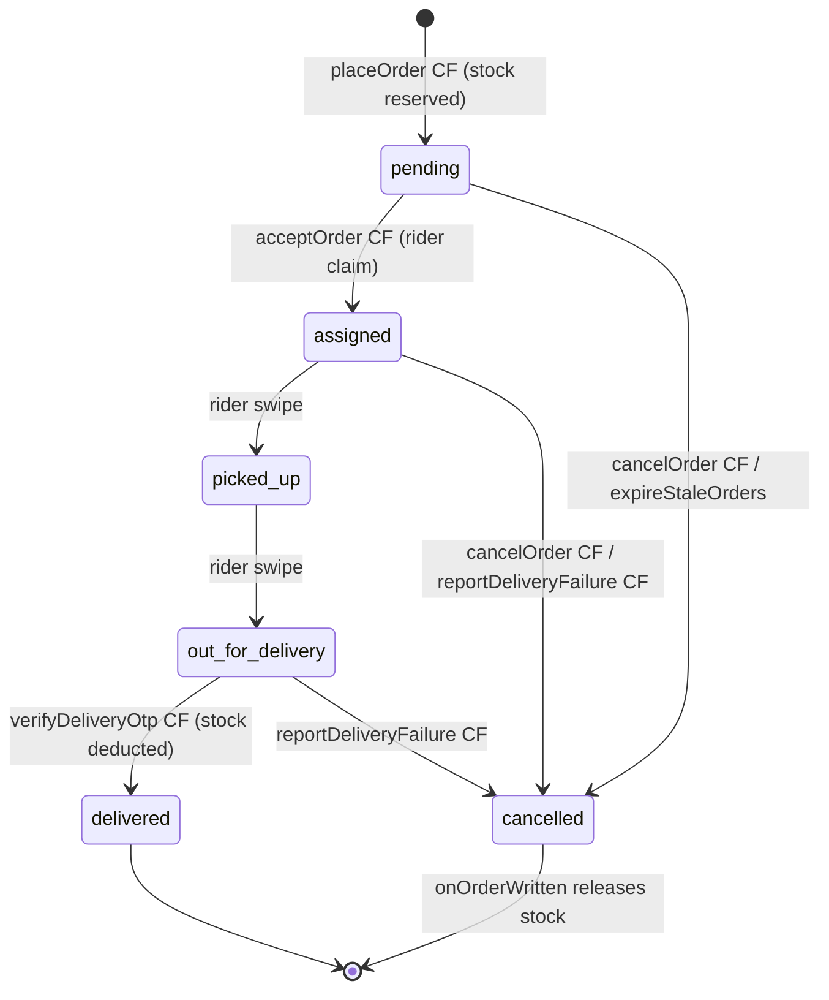
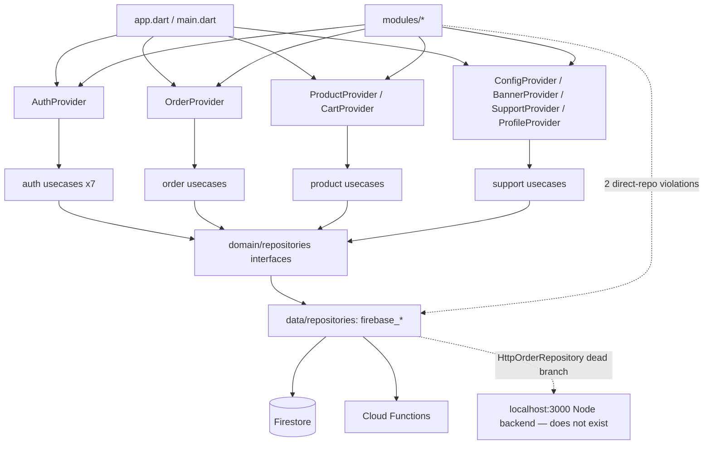

# Architecture

## Purpose
How the system is structured and why; boundaries, layers, and the invariants that keep it safe.

## Key facts

### Style
Flutter client with **Clean Architecture** layering over a **Firebase serverless backend**. State management is **Provider/`ChangeNotifier`** (NOT Riverpod — CLAUDE.md's "Quick Commerce Guidelines" section claims Riverpod+Freezed and is wrong; see [TECH_STACK.md](TECH_STACK.md)).

One-way dependency flow (enforced by convention, not tooling):

```
UI (lib/modules) → Providers (lib/core/providers) → UseCases (lib/domain/usecases)
  → Repository interfaces (lib/domain/repositories) → Implementations (lib/data/repositories) → Firebase
```

### Enforcement status
The layering is real but has known leaks: `order_history_screen.dart:255` and `order_tracking_screen.dart:840` construct `FirebaseProductRepository()` directly in widgets; `main.dart:126` wires `OrderProvider` with `HttpOrderRepository()` (a delegating shim whose Node-backend branch is dead — [backend_config.dart](../../lib/core/services/backend_config.dart) `useNodeBackend = false`).

### Backend topology
- **Callable functions** (`onCall`, all `enforceAppCheck: true` outside the emulator): `placeOrder` ([index.ts:247](../../functions/src/index.ts#L247)), `cancelOrder` (:444), `reportDeliveryFailure` (:507), `verifyDeliveryOtp` (:560), `resetOtpAttempts` (:673), `acceptOrder` (:718), `createRiderLogin` (:1064), `sendTestPush` (:1135), `getCloudinarySignature` (:1169).
- **Firestore triggers**: `onOrderWritten` (:775), `onRiderWritten` (:962), `onProductWritten` (:1008), `onAdminWritten` (:1035).
- **Scheduled**: `escalateStaleOrders` (every 1 min, :1209), `expireStaleOrders` (every 30 min, :1256).
- All money/stock math is **server-authoritative**; the client's totals are preview-only.

### Critical domain rules (must hold everywhere)
1. **Stock formula**: `availableStock = physicalStock − reservedStock`; the three fields plus legacy `stock` always move together inside `runTransaction` (functions `placeOrder`/`verifyDeliveryOtp`/`onOrderWritten`; client `adjustStock`).
2. **Inventory ledger**: every stock delta writes an `/inventoryLogs` entry with `changeType`, deltas, and actor.
3. **Admin-only writes**: `/products`, `/config`, `/inventoryLogs`, `/banners` are admin-claim gated in [firestore.rules](../../firestore.rules).
4. **`delivered` only via `verifyDeliveryOtp`**; order status advances exactly one step per rider action; OTP lives in `orders/{id}/private/delivery` readable only by the ordering customer.
5. **Broadcast dispatch**: orders are claimed exclusively by riders through `acceptOrder` (transactional first-wins); `escalateStaleOrders` re-broadcasts every 90 s forever; `expireStaleOrders` auto-cancels >24 h pending orders and releases stock.
6. **Riders never see customer PII before accepting.** Unclaimed orders are exposed to riders only through `/orderOffers/{orderId}` (first name, village, items, totals; written by the `onOrderWritten` trigger, client writes denied). The full order — phone, street address, GPS pin — becomes readable to a rider only once `acceptOrder` sets `deliveryBoyId` to them.
7. **Admin order writes are narrow.** Rules let an admin only cancel an open order or hand it back to the pool (`status` → `cancelled`/`pending`); `delivered` is reachable solely via `verifyDeliveryOtp`, and money/items are immutable. The `cancelOrder` callable refuses `delivered`/`cancelled` orders for everyone. `isAdmin()` also checks `admins/{uid}.isActive`, and deactivating a rider/admin disables the Auth user and revokes refresh tokens (`onRiderWritten` / `onAdminWritten`).
8. **Idempotent placement.** `placeOrder` accepts a client `requestId`; the order id is derived from `(uid, requestId)`, so a retry returns the existing order (`deduplicated: true`). Rate limits are Firestore-backed (`/rateLimits`, set a TTL policy on `expireAt`). A failed stock release flags the order `stockReleaseFailed` and `repairStockReleases` (every 15 min) retries it.

## Mermaid — order lifecycle



## Mermaid — module dependency graph (major seams)



## Coupling notes
- **Villages duplication** is deliberate: `lib/core/data/villages.dart` (rich data: mandal, district) and the `VILLAGES` array in `functions/src/index.ts:69-75` (centroids only) must be updated together; both files carry "update both together" comments.
- **`inventoryLogs` schema** differs by writer: functions write `adminId`+`actorType`, client writes `actorId`+`actorType`; the DTO accepts both ([inventory_ledger_dto.dart:22](../../lib/data/models/inventory_ledger_dto.dart#L22)). See audit finding H-1.
- Triggers use `statsRef.set(..., {merge: true})` — self-healing; no seeding dependency (the old `.update()` fragility is gone).

## Important file paths
| Area | Path |
|---|---|
| Root widget / role routing | `lib/app.dart` (`AuthWrapper`), `lib/main.dart` |
| All callables/triggers | `functions/src/index.ts` (single 1,293-line file) |
| Security rules | `firestore.rules`, `storage.rules` |
| Providers | `lib/core/providers/*.dart` |
| Repo implementations | `lib/data/repositories/*.dart` |
| Design system | `lib/core/design/app_tokens.dart`, `lib/core/theme/app_theme.dart` |

## Open questions / unknowns
- Should `HttpOrderRepository` + the Node-backend branch be deleted, or is the Node backend planned? (Dead code today.)
- No architectural decision records exist; layering rules live only in CLAUDE.md (partially contradicted there — needs one authoritative doc).
