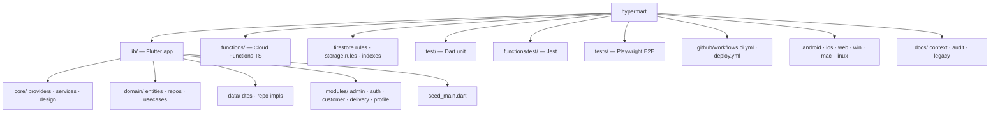

# Codebase Map

## Purpose
Orient a new contributor: what lives where, with sizes and roles. Paths relative to repo root.

## Key facts

### Top-level layout
| Path | Role |
|---|---|
| `lib/` | Flutter app (140 Dart files, ~26,500 LOC) |
| `functions/` | Firebase Cloud Functions (TypeScript, single `src/index.ts` of 1,293 lines) |
| `test/` | Dart unit tests (8 files — models/DTOs/entities only) |
| `functions/test/` | Jest tests (callables + rules-logic tests) |
| `tests/` + `playwright.config.ts` | Playwright web E2E (5 specs, chromium) |
| `scripts/` | `seed.js`, `start_emulators.bat` |
| `firestore.rules` / `storage.rules` / `firestore.indexes.json` | Database security & query indexes |
| `android/` `ios/` `web/` `windows/` `macos/` `linux/` | Platform shells (Android is the only QA'd target) |
| `docs/` | Legacy docs (stale) + this `context/` set + `audit/` |

### `lib/` internals
| Path | Role | Notes |
|---|---|---|
| `lib/main.dart` | Boot: Firebase init, App Check, Crashlytics, FCM handlers, MultiProvider DI | ~10 providers |
| `lib/app.dart` | `JCMartApp` + `AuthWrapper` (status → role → home screen) | |
| `lib/core/providers/` | 9 ChangeNotifiers: auth, banner, cart, config, order, product, profile, support, theme | |
| `lib/core/services/` | `cloudinary_service`, `push_notification_service`, `notification_handler`, `backend_config` | |
| `lib/core/config/emulator_config.dart` | `--dart-define=USE_FIREBASE_EMULATOR=true` emulator wiring | |
| `lib/core/data/villages.dart` | Service-area villages (source of truth on the client) | duplicated in functions |
| `lib/core/design/` | `app_tokens.dart` + 16 shared widgets (product card, swipe-to-confirm, OTP grid, floating navbar…) | |
| `lib/core/models/user_model.dart` | `UserModel` + `AddressModel` (290 lines) | |
| `lib/domain/` | 12 entities, 7 repo interfaces, 26 use cases | pure, no Firebase imports |
| `lib/data/` | 7 DTOs, 8 repo implementations | `http_order_repository` = delegating shim |
| `lib/modules/admin/screens/` | Admin console. **`admin_home_screen.dart` is 1,985 lines** (was 3,568 — partially decomposed; widgets moved to `screens/widgets/`) | god-file remains |
| `lib/modules/customer/screens/` | Home, cart, checkout, product details, search, orders, tracking, success + `support/` | |
| `lib/modules/delivery/screens/` | Rider home, task detail, map, earnings + OTP grid | |
| `lib/modules/profile/screens/` | Profile, address CRUD, wishlist, terms, privacy | |
| `lib/seed_main.dart` | Standalone app entry that seeds 10 demo products | dev-only tool |

### Screen inventory (26 screens)
Auth (3): unified login, customer profile setup. Customer (10): home, search, product details, cart, checkout, order success/history/tracking, support hub/chat. Delivery (4): home, task detail, map, earnings. Admin (7): home, add rider, banner management, inventory logs, store settings, admin profile, support. Profile (6): user profile, address book + add/edit/delete, wishlist, privacy, terms.

## Mermaid — repo tree (major branches only)

## Notable sizes
- Largest files: `admin_home_screen.dart` (1,985), `order_tracking_screen.dart` (931), `delivery_home_screen.dart` (804), `customer_support_hub_screen.dart` (775), `support_chat_screen.dart` (747).
- Cloud Functions is a single 1,293-line module — all 13 functions share one file and one rate-limiter store.

## Open questions / unknowns
- `scripts/seed.js` vs `functions/seed.js` vs `functions/seed_admin.js` vs `lib/seed_main.dart` — four seeding entry points; which is canonical? (Needs verification with the team.)
- `playwright-report/`, `test-results/`, `android/build/` are build artifacts present in the working tree — confirm they should stay git-ignored.
