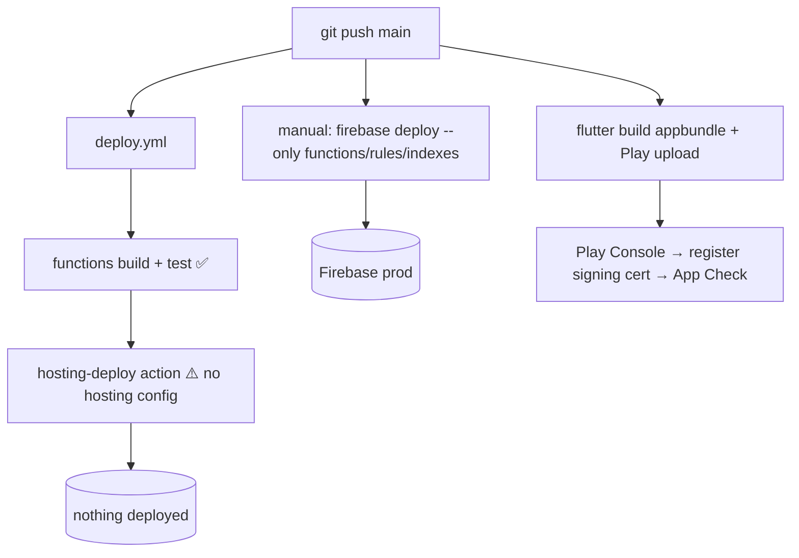

# Deployment

## Purpose
How the app reaches users, what deploys automatically vs manually, and what must be true before release.

## Key facts

### Environments
| Env | Firebase project | Reality |
|---|---|---|
| Local dev | emulators (auth :9099, firestore :8090, functions :5001) | `--dart-define=USE_FIREBASE_EMULATOR=true` |
| Production | `hypermart-ee8ef` ([.firebaserc](../../.firebaserc)) | the only real environment — **no staging project** |

### What deploys from CI
- `deploy.yml` (push to main) runs functions build + tests, then `FirebaseExtended/action-hosting-deploy@v0` with `secrets.FIREBASE_SERVICE_ACCOUNT`. **Mismatch**: `firebase.json` has **no `hosting` section**, and Cloud Functions are not deployed by this action. Net effect: **the deploy workflow deploys nothing meaningful today** (audit M-4). Actual deploys are manual.

### Manual deploy commands (the real process)
```bash
npm --prefix functions run build
firebase deploy --only functions           # 13 functions, asia-south1
firebase deploy --only firestore:rules,firestore:indexes
firebase deploy --only storage             # storage.rules
firebase functions:secrets:set CLOUDINARY_API_SECRET
firebase functions:secrets:set CLOUDINARY_API_KEY
flutter build appbundle --release          # Android release (aab)
```

### Android release state
- [build.gradle.kts:39](../../android/app/build.gradle.kts#L39): `applicationId = "com.example.hypermart"` — **Play rejects `com.example.*`; the ID is irreversible after first publish.** Same for `namespace` (:24).
- Release signing: reads `android/key.properties` (git-ignored); **falls back to debug signing keys if the keystore file is absent** (:50-58). R8/minify enabled with `proguard-rules.pro`.
- App Check uses `AndroidProvider.playIntegrity` in release ([main.dart](../../lib/main.dart)) — requires the **Play App Signing** SHA-256 registered in the Firebase App Check console after the first Play upload, otherwise all `enforceAppCheck` callables reject real users (silent failure mode; local testing still works).

### iOS / Web
- iOS: `firebase_options.dart` carries an iOS app ID; no signing/entitlements QA evidence in repo — **untested target**.
- Web: `flutter build web` supported; Playwright E2E runs against it; Hosting not configured (see above).

### Operational run-cadence (server side, all automatic)
- `escalateStaleOrders` every 1 min; `expireStaleOrders` every 30 min; trigger functions on every relevant doc write. Scheduled functions bill on invocation — covered by free tier at village scale; set a GCP budget alert (console action, not code).

### Release checklist (condensed — see docs/audit/ACTION_PLAN.md)
1. Fix applicationId/namespace (irreversible once published).
2. Keystore + `key.properties` present → release signing; back the keystore up durably.
3. Register Play App Signing SHA-256 for App Check.
4. Deploy functions/rules/indexes; verify `config/app` seeded and first admin exists.
5. Privacy policy URL + Play Data Safety declarations (location, phone, name, order history; Cloudinary/Firebase sharing).
6. Closed testing track (12 testers × 14 days for new Play accounts).

## Mermaid — release flow (as-is vs intended)


## Open questions / unknowns
- Who/what performs production deploys today — a person, a script, or nothing? (Repo evidence: manual only.)
- Is web hosting actually desired (no `hosting` block)? If not, deploy.yml should deploy functions or be removed.
- Play Console account status (new vs established) determines the closed-testing calendar requirement — needs verification with the business owner.
- Keystore durability: `upload-keystore.jks` exists locally (git-ignored); backup status unknown — losing it loses the app identity.
