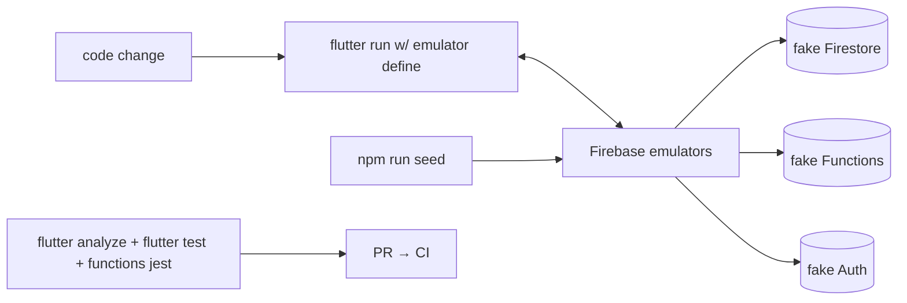

# Onboarding

## Purpose
Get a new developer from clone to a working dev environment and first PR, with the gotchas that aren't obvious from the code.

## Key facts

### Prerequisites
- Flutter SDK (CI pins 3.27.x — match it locally), Dart ^3.7, Android Studio/SDK for the Android toolchain.
- Node 20 (functions), Java (Firebase emulators need it), Firebase CLI (`firebase-tools`) logged in.
- A device or emulator for Android; Chrome for web.

### First-run setup (~20 min)
```bash
git clone <repo> && cd hypermart
flutter pub get                          # Dart deps
npm --prefix functions install           # Functions deps
npm install                              # root: Playwright + scripts

# Firebase emulators (no real project needed for dev)
npm run emulators                        # auth :9099, firestore :8090, functions :5001, UI :4000

# App against emulators (Android emulator host is 10.0.2.2 automatically)
flutter run --dart-define=USE_FIREBASE_EMULATOR=true

# Seed demo data (choose ONE; see CODEBASE_MAP.md open questions)
node scripts/seed.js                     # or: flutter run -t lib/seed_main.dart
```
If `lib/firebase_options.dart` / `android/app/google-services.json` are missing or you use your own Firebase project: `flutterfire configure` (project `hypermart-ee8ef` is pinned in `.firebaserc`).

### Verify your setup
```bash
flutter analyze                          # expect 0 issues
flutter test                             # Dart unit tests pass
npm --prefix functions test              # Jest suites pass
```

### Golden rules (violations will be caught in review)
1. **Never call Firestore/Firebase from widgets or providers directly** — go through a repository interface. (Two known violations exist: `order_history_screen.dart:255`, `order_tracking_screen.dart:840` — don't add a third.)
2. **Any stock change must move `physicalStock` + `reservedStock` + `availableStock` (+ legacy `stock`) together inside a transaction** and write an `inventoryLogs` entry.
3. **Never read money math from the client** — client totals are preview; the server recalculates.
4. **Never ship a secret in the client** — secrets live in Firebase Secret Manager, accessed from Functions.
5. Use design tokens (`lib/core/design/app_tokens.dart`), not hardcoded colors.
6. No `BuildContext` across async gaps; wrap repo calls in try/catch returning structured results.

### Where to look first (by task)
| Task | Start at |
|---|---|
| New screen | `lib/modules/<persona>/screens/` + `RouteGenerator` |
| New business rule | `lib/domain/usecases/` then wire via provider |
| New Firestore access | `lib/domain/repositories/` (interface) → `lib/data/repositories/` (impl) → rules in `firestore.rules` |
| New callable | `functions/src/index.ts` (+ test in `functions/test/`) |
| UI polish | `lib/core/design/` tokens and shared widgets |

### Deploy & release
See [DEPLOYMENT.md](DEPLOYMENT.md) — note that **CI does not deploy functions** (the workflow targets Hosting, which isn't configured); deploys are manual `firebase deploy` commands. Android release identity is still `com.example.hypermart` — do not publish until fixed.

### Known sharp edges
- CLAUDE.md's "Quick Commerce Guidelines" (Riverpod/Freezed) does **not** match the code (Provider/hand-written DTOs). Follow the code; the doc fix is tracked in the audit (M-6).
- `emulator_config.dart` disables App Check and Firestore persistence under the emulator — don't "fix" the resulting behavior differences.
- The jest setup mocks all of `firebase-admin`; function tests don't hit a real Firestore. Rules are tested as logic-mirrors, not the real rules file.
- Emulator + web: run `npm run build:web` (passes the emulator define) before Playwright.
- Working tree is currently dirty with a large in-flight refactor (support module, checkout, App Check). Branch carefully.

## Mermaid — dev loop


## Open questions / unknowns
- Which seed script is canonical (four exist)? Needs a team decision.
- Is there a shared dev Firebase project, or does each dev emulate? (Emulator path is fully wired, so shared project is likely unnecessary.)
