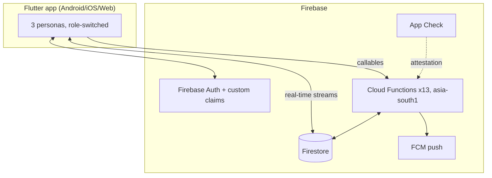

# Project Overview

## Purpose
Single source of truth on what **J C Mart** (`hypermart`) is, who uses it, and its current state. Companion files live in `docs/context/`.

## Key facts

| Item | Value |
|---|---|
| Product | **J C Mart** — hyperlocal quick-commerce (grocery) app with COD fulfillment and rider broadcast dispatch |
| Package | `hypermart` ([pubspec.yaml](../../pubspec.yaml)), version 1.0.0+1 |
| Business model | Cash on Delivery only — no payment gateway by design |
| Service area | Bhimavaram + 4 villages (Veeravasaram, Rayakuduru, Srungavruksham, Mentada); 12 km geofence around village centroids |
| Personas | Customer, Delivery Partner (rider), Store Admin — one Flutter app, role-switched at login |
| Backend | Firebase serverless (Auth, Firestore, Cloud Functions v2, FCM, App Check, Crashlytics, Analytics); Cloudinary for images |
| Region | All Cloud Functions `asia-south1` (Mumbai) — latency for the India service area |
| Repo | `HOTA-CREATIVES/blinkbasket` on GitHub (name drift: "blinkbasket" is a legacy project name) |

## Product capabilities (implemented)
- **Customer**: unified 3-role login, Google Sign-In, profile onboarding, catalog browse/search/wishlist, persistent cart (Firestore-synced), checkout with map pin + swipe-to-confirm, OTP display, order tracking, cancel/rate/reorder, support tickets.
- **Rider**: on-duty toggle, Blinkit-style broadcast offers (self-accept via `acceptOrder`), swipe status progression, OTP-verified delivery, delivery-failure reporting, map, earnings.
- **Admin**: biometric-locked console — dashboard stats, order queue with manual override, product CRUD + Cloudinary image upload, stock adjustment with inventory ledger, rider provisioning (server-generated passwords), store settings, banner management, support desk.

## Current state (audited 2026-09-29)
- Feature-complete for the scoped pilot; ~26,500 LOC Dart across 140 files, 1,293-line Cloud Functions module.
- Historically-flagged critical gaps (Cloudinary secret in client, admin backdoor, no App Check, no crash reporting, no order expiry) are **all fixed** in the current working tree — see [SECURITY_MODEL.md](SECURITY_MODEL.md).
- Main remaining risks: **release identity still `com.example.hypermart`** (Play-rejected, irreversible once published), **cross-actor schema drift** between client and server ledger writes, stale docs, weak Flutter-side test suite.

## Mermaid — system at a glance

## Open questions / unknowns
- Is iOS a real target? (`firebase_options.dart` has an iOS app ID, but no iOS QA evidence or signing setup in repo.)
- What is the real legal business name for the Play listing ("J C Mart" vs "HyperMart" vs "JP Mart" appear across docs)?
- Target launch date — determines urgency of release-identity and store-listing work.
