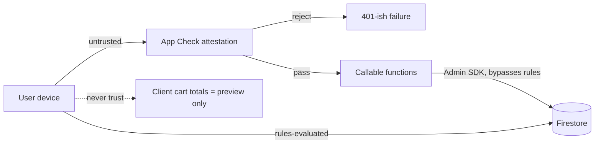

# Security Model

## Purpose
AuthN/AuthZ design, trust boundaries, data protection, and the security-relevant invariants. Complements [API_CONTRACTS.md](API_CONTRACTS.md).

## Key facts

### Identity & roles (AuthN)
- Firebase Auth: Email/Password + Google Sign-In. Roles: `customer` (default), `delivery`, `admin`.
- RBAC via **custom claims** set *only* by trigger functions: `onAdminWritten` syncs `{role:"admin", admin:true}` from `admins/{uid}` (doc ID must equal the UID); `onRiderWritten` syncs `{role:"delivery", delivery:true}`. Claims flip only when active-state flips (write-amplification guarded).
- Clients re-verify role live against Firestore every 5 min (token-refresh ticker in [auth_provider.dart:31-34](../../lib/core/providers/auth_provider.dart#L31-L34)) and on every auth event; deactivated accounts are force-logged-out.
- Riders exist only if provisioned by an admin through `createRiderLogin` (doc ID == UID; no self-signup path — client-side UID migration was removed).
- **No backdoor exists**: the old `admin@blinkbasket.com` fallback is gone (code-search across repo: only doc/package-name references to "blinkbasket" remain).

### Trust boundaries

- **Client-side (firestore.rules)**: role-gated reads/writes per collection; order create/delete impossible; status-machine and field-allowlist enforcement; OTP subcollection readable only by the ordering customer; catch-all deny.
- **Server-side (Admin SDK)**: functions bypass rules but re-validate everything (auth, profile active, store-open, geofence, stock in transaction).
- **Money/stock math is server-only** — the client's totals are labeled preview.

### Hardening present (verified in code)
| Control | Evidence |
|---|---|
| App Check enforced on all sensitive callables (`enforceAppCheck: true`, disabled only under emulator) | every `onCall` in [index.ts](../../functions/src/index.ts) |
| Per-UID per-action rate limiting (20/min, in-memory) | index.ts:28-46 |
| Cloudinary API secret in Secret Manager; client requests short-lived signed uploads from `getCloudinarySignature` (admin-only) | index.ts:1169-1206; [cloudinary_service.dart](../../lib/core/services/cloudinary_service.dart) |
| Geofence requires coordinates (missing coords rejected, not skipped) | index.ts:274-281 |
| Pending-order cap per customer (3) against COD spam | index.ts:27, placeOrder |
| OTP: 4-digit server-generated, 5-attempt cap surviving transaction rollback, admin reset path | verifyDeliveryOtp / resetOtpAttempts |
| Rider passwords generated server-side (`randomBytes(9)`) — never admin-chosen | createRiderLogin |
| Firestore rules: field allowlists, immutable role/isActive, write-once rating, deny-all catch-all | firestore.rules |
| Storage rules: 5 MB caps, content-type allowlists, admin-existence checks | storage.rules |
| Crashlytics + Analytics wired (`runZonedGuarded`, `FlutterError.onError`) | main.dart |
| Ledger write idempotency (`stockReleased` guard) against trigger replay | onOrderWritten |

### Residual risks (details in docs/audit/FINDINGS.md)
1. **Cross-actor schema drift in `inventoryLogs`** (functions write `adminId`, client writes `actorId` as actor key) — audit integrity gap, not a privilege hole (H-1).
2. `products` are **publicly readable** (`allow read: if true`, [firestore.rules:67](../../firestore.rules#L67)) including cost-adjacent fields — likely fine, should be a decision (L-1).
3. In-memory rate limiter is per-instance and resets on cold start — throttling is approximate (L-3).
4. Android release identity/signing is still placeholder — a release-gating operational risk (M-2).
5. `AdminProfileScreen` exists but has no caller; admin profile edits route through `users/{uid}` (allowlisted) — verify no admin-privileged edit path is missing (L-4).

### Data protection / PII
- Collected: name, email, phone, precise location (FINE/COARSE permissions in [AndroidManifest.xml:10-11](../../android/app/src/main/AndroidManifest.xml#L10-L11)), addresses, order history, FCM tokens; prescription *storage rules* exist but no upload code (unused).
- Written to logs? No PII found in `console.log` calls in functions (order IDs only). Client uses `debugPrint` (no-op in release).
- No PII-in-error-reporting guard needed yet (Crashlytics default breadcrumbs) — worth re-checking when custom keys get added.

## Open questions / unknowns
- Password reset for riders: `createRiderLogin` generates a password but no forced-change flow exists; no rider-facing password reset was verified. How are lost rider passwords handled?
- OSM tile usage: production apps should comply with OSM tile policy (attribution present in map widgets — verify).
- Google Play Data Safety declarations not yet written (business action, blocks launch).
- `cloudinaryApiKey` moved into Secret Manager too — verify it was actually set before deploying `getCloudinarySignature` (deploy fails or runtime-errors if unset).
