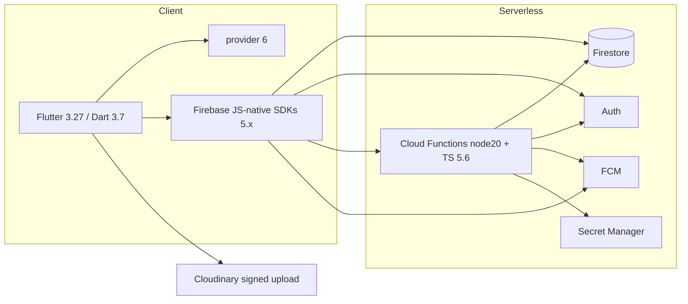

# Tech Stack

## Purpose
Exact technologies and versions in use, with config pointers — so nobody reinstalls the wrong thing.

## Key facts

### Client
| Tech | Version | Evidence |
|---|---|---|
| Flutter / Dart SDK | flutter-version pinned 3.27.x in CI; Dart `^3.7.0` | [ci.yml:17](../../.github/workflows/ci.yml#L17), [pubspec.yaml](../../pubspec.yaml) |
| State management | `provider ^6.1.2` (ChangeNotifier) | pubspec.yaml |
| Firebase (client) | core 3.10, auth 5.4, firestore 5.6, messaging 15.1, app_check 0.3, crashlytics 4.3, analytics 11.5, cloud_functions 5.6 | pubspec.yaml |
| Auth extras | `google_sign_in ^6.2.2`, `local_auth ^2.3.0` (biometric admin gate) | pubspec.yaml |
| Maps/location | `geolocator ^14`, `flutter_map ^8.3` (OSM), `latlong2 ^0.10` | pubspec.yaml |
| Media | `image_picker`, `cached_network_image`, `flutter_svg`, `shimmer`, `share_plus` | pubspec.yaml |
| Misc | `shared_preferences`, `url_launcher`, `http`, `crypto`, `google_fonts`, `package_info_plus` | pubspec.yaml |

### Backend
| Tech | Version | Notes |
|---|---|---|
| Node (Functions runtime) | 20 | [functions/package.json](../../functions/package.json) engines |
| firebase-functions | ^6.1.0 (v2 API: onCall/onDocumentWritten/onSchedule/defineSecret) | |
| firebase-admin | ^12.7.0 | |
| TypeScript | ^5.6.3 | functions/tsconfig.json |
| Secrets | Secret Manager via `defineSecret("CLOUDINARY_API_SECRET" / "CLOUDINARY_API_KEY")` | index.ts:10-11 |

### Tooling / test
- Jest ^29 + ts-jest + `@firebase/rules-unit-testing` + `firebase-functions-test` (functions).
- Playwright ^1.62 (root `package.json`, TS ^7.0.2 devDep) — web E2E against emulator builds.
- `flutter_lints ^5.0.0`; no `build_runner`/`freezed` (hand-written DTOs).
- Emulator suite: auth :9099, firestore :8090, functions :5001, UI :4000 ([firebase.json](../../firebase.json)).

### Mermaid — stack layers

## Config notes
- Flutter version is pinned only in CI (3.27.x); local dev uses whatever is installed (lockfile pins pub packages, not the SDK).
- `analysis_options.yaml` uses stock `flutter_lints` — no custom rules, no CI formatting check (dart format not enforced).
- `tsconfig.json` (root) is for Playwright tests only (`tests/**`), strict mode.

## Open questions / unknowns
- **Doc/code contradiction**: CLAUDE.md's "Quick Commerce Guidelines" mandate Riverpod + Freezed + `Either<Failure, Success>`; the codebase uses Provider + hand-written DTOs + exceptions/`PlaceOrderResult`. One authoritative convention doc is needed (see audit M-6).
- Root `package.json` declares `"license": "ISC"` while `docs/srs.md` references MIT licensing; there is no LICENSE file (audit L-2).
- Is `typescript ^7.0.2` (devDep) intended? TS 7 is very new; functions use ^5.6.3. Needs verification.
