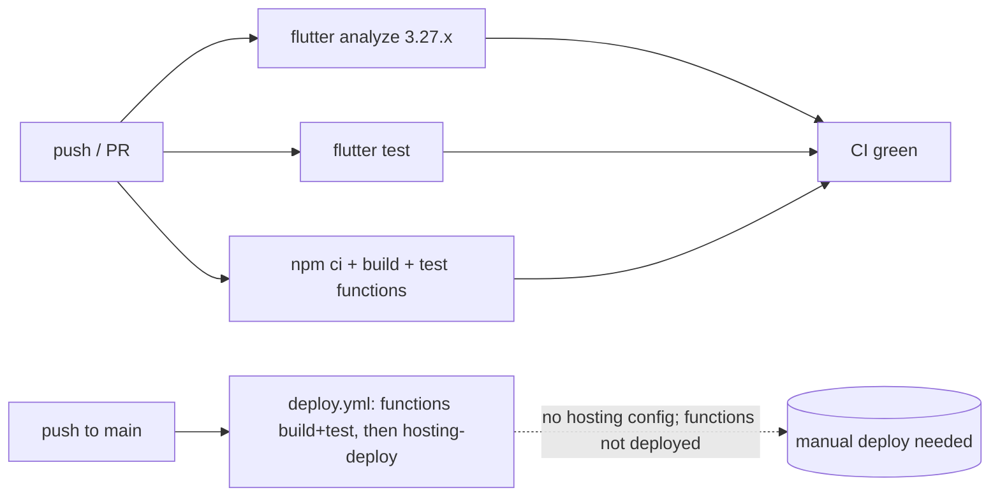

# Testing

## Purpose
What is tested, how to run it, and where the coverage gaps are.

## Key facts

### Three test layers
| Layer | Runner | Location | Count | Runs in CI? |
|---|---|---|---|---|
| Dart unit (models/DTOs/entities) | `flutter test` | `test/core|data|domain/` (8 files) | ~8 suites | ✅ ci.yml `flutter-test` job |
| Cloud Functions (callables + triggers) | Jest | `functions/test/*.test.ts` | 5 suites: placeOrder (135 L), verifyDeliveryOtp (94 L), cancelOrder (69 L), reportDeliveryFailure (83 L), firestoreRules (349 L) | ✅ ci.yml `functions-test` job |
| Web E2E | Playwright | `tests/*.spec.ts` (5 specs) | auth, catalog/cart, checkout, rider, admin | ❌ **not in CI** |

### How to run
```bash
flutter test                                # Dart unit tests
npm --prefix functions test                 # Jest (mocked admin SDK — no emulator needed)
npm --prefix functions run serve            # emulators for manual testing
npm run test:e2e                            # Playwright (serves build/web on :3000)
npm run test:e2e:ui                         # Playwright UI mode
npm run test:report                         # show Playwright HTML report
```

### Jest architecture (important)
`functions/test/jest.setup.js` **mocks the entire firebase-admin SDK** (firestore, auth, messaging, app, functions-params). So callable tests validate **business logic against a mocked DB**, not real Firestore semantics; `firestoreRules.test.ts` (349 lines) re-implements rules conditions as plain assertions and validates their *logic*, not the deployed rules file. This is much weaker than true emulator-based rules tests (`@firebase/rules-unit-testing` is a devDependency but unused in tests — needs verification whether any file imports it).

### E2E config
[playwright.config.ts](../../playwright.config.ts): `workers: 1` (deterministic Firebase state), retries 0, 60 s timeout, baseURL `http://127.0.0.1:3000`, auto-starts `npx serve build/web -p 3000`. Requires `USE_FIREBASE_EMULATOR=true` build + running emulators.

## Mermaid — CI pipeline (ci.yml)


## Coverage gaps (evidence-based)
- **No Dart tests for any provider or use case** — `test/` covers models/DTOs/entities only. `AuthProvider` role-discovery logic (the most intricate client code) is untested. (Old `test/provider_usecase_test.dart`, `customer_flow_test.dart`, `widget_test.dart` are deleted in the working tree — untracked replacements don't cover providers.)
- **No tests at all** for: `resetOtpAttempts`, `sendTestPush`, `getCloudinarySignature`, `createRiderLogin`, `acceptOrder`, `escalateStaleOrders`, `expireStaleOrders`, `onOrderWritten`/`onRiderWritten`/`onProductWritten`/`onAdminWritten` (8 of 13 functions).
- No widget tests; no `integration_test/`; E2E excluded from CI.
- No coverage tooling configured (`--coverage` for jest not enabled; no `coverage` dir conventions).

## Open questions / unknowns
- Are the deleted legacy Flutter tests (`test/widget_test.dart` etc.) superseded by the current `test/{core,data,domain}` set, or lost? The deleted files are only in the working tree's git status; last-commit state still has them.
- Does any rules test actually execute the real `firestore.rules` file? Current evidence says no — `@firebase/rules-unit-testing` appears unused (needs verification by grep on import).
- Playwright specs are 34–146 lines each; are they smoke-level only? (Read before trusting them as regression coverage.)
