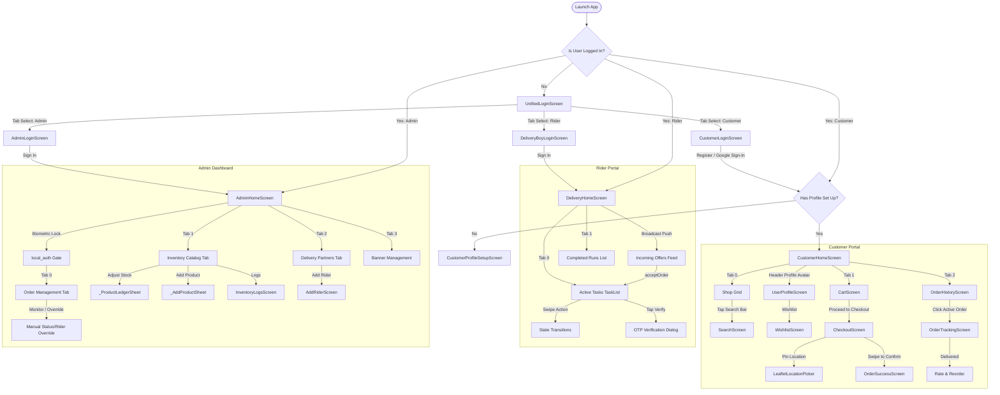

# HyperMart Implemented Screens & UI Flows Documentation

This document describes all the UI screens implemented in the **HyperMart** (J C Mart) application, highlighting their layouts, features, state management bindings, and navigation flows.

---

## UI Navigation & App Flow

The application navigates based on the user's authenticated state and roles (`admin`, `delivery`, `customer`).

---

## 1. Authentication & Onboarding Screens

### A. Unified Login Screen (`UnifiedLoginScreen`)
* **Path**: [unified_login_screen.dart](file:///c:/Users/gurun/Documents/PROJECTS/hota-projects/hypermart/lib/modules/auth/screens/unified_login_screen.dart)
* **Role**: All Roles (Entry Screen)
* **Layout Design**: Minimal, modern layout featuring a unified TabBar at the top with three options: **Customer**, **Delivery Partner**, and **Administrator**. Colors and icons dynamically shift to match the selected role's theme:
  * Customer: Forest green (`AppColors.customerPrimary`)
  * Delivery: Vibrant Orange (`Colors.orange.shade800`)
  * Admin: Slate Blue (`Colors.blue.shade800`)
* **State / Provider Binding**: Binds to `AuthProvider` via `setSelectedRole` to coordinate authentication flows.
* **Features**:
  * Seamless horizontal paging disabled (`NeverScrollableScrollPhysics`) to keep focus on input.
  * Dynamically renders role-specific sub-login panels inside a `TabBarView`.

### B. Customer Login Screen (`CustomerLoginScreen`)
* **Path**: [customer_login_screen.dart](file:///c:/Users/gurun/Documents/PROJECTS/hota-projects/hypermart/lib/modules/auth/screens/customer_login_screen.dart)
* **Role**: Customer
* **Layout Design**: Standard card-based form with custom circular input borders and dynamic validation overlays. Displays a cute shopping cart vector graphic.
* **Features**:
  * Tabbed selector for **Sign In** and **Sign Up**.
  * Input fields: Email, password, and password verification.
  * Standard Firebase Email/Password Authentication.
  * Google Sign-In button integrating brand-compliant vectors.

### C. Delivery Partner Login Screen (`DeliveryBoyLoginScreen`)
* **Path**: [delivery_boy_login_screen.dart](file:///c:/Users/gurun/Documents/PROJECTS/hota-projects/hypermart/lib/modules/auth/screens/delivery_boy_login_screen.dart)
* **Role**: Delivery Rider
* **Layout Design**: Professional slate layout with orange accent highlights.
* **Features**:
  * Email/Password sign-in.
  * Automatic whitelist validation: Upon successful credential auth, it checks whether the user's email is present in the `deliveryBoys` Firestore collection. If found, it links the user's UID to that whitelisted document.

### D. Administrator Login Screen (`AdminLoginScreen`)
* **Path**: [admin_login_screen.dart](file:///c:/Users/gurun/Documents/PROJECTS/hota-projects/hypermart/lib/modules/auth/screens/admin_login_screen.dart)
* **Role**: Admin
* **Features**:
  * Secure administrative sign-in portal.
  * Verifies custom auth admin claims before granting portal dashboard entry.

### E. Customer Onboarding Screen (`CustomerProfileSetupScreen`)
* **Path**: [customer_profile_setup_screen.dart](file:///c:/Users/gurun/Documents/PROJECTS/hota-projects/hypermart/lib/modules/auth/screens/customer_profile_setup_screen.dart)
* **Role**: Customer (Mandatory Onboarding)
* **Layout Design**: Clean, back-locked onboarding layout (hides default back buttons to force profile completeness).
* **Features**:
  * Text fields: Customer Name (auto-caps words), Mobile Number (numeric keypads, length $\ge$ 10).
  * Village dropdown selection (`VillageDropdown`) matching logistics clusters (Bhimavaram, Veeravasaram, Rayakuduru, Srungavruksham, Mentada).
  * Red "Cancel & Sign Out" link.

---

## 2. Customer Portal Screens

### A. Customer HomeScreen (`CustomerHomeScreen`)
* **Path**: [customer_home_screen.dart](file:///c:/Users/gurun/Documents/PROJECTS/hota-projects/hypermart/lib/modules/customer/screens/customer_home_screen.dart)
* **Role**: Customer
* **Layout Design**: Three-tab primary interface utilizing an `IndexedStack` to maintain state across tabs, coupled with a modern **Floating Bottom Navigation Bar (`FloatingNavbar`)**.
* **Floating Navbar Geometry & Design**:
  * Occupies **~70% of total screen width**, horizontally centered above the bottom safe area.
  * Rounded pill container (`BorderRadius.circular(32)`) with multi-layered elevation shadows and outline border.
  * Micro-animations: `AnimatedContainer` active pill highlight, `AnimatedScale` icon pop (1.15x scale), and animated text weight/color transitions.
  * Header avatar button in top green header opens `UserProfileScreen`.
* **Tabs**:
  * **Store Tab**: Includes a top location banner ("Deliver to: Village"), search text field, category chips, and a dual-column `GridView` of product cards.
  * **Cart Tab**: Opens `CartScreen`.
  * **My Orders Tab**: Opens `OrderHistoryScreen`.

### B. Cart Screen (`CartScreen`)
* **Path**: [cart_screen.dart](file:///c:/Users/gurun/Documents/PROJECTS/hota-projects/hypermart/lib/modules/customer/screens/cart_screen.dart)
* **Role**: Customer
* **Features**:
  * Detailed item list with quantity steppers and clear cart options.
  * Saved address selector with fixed instance equality checks (`operator ==` & `hashCode` on `AddressModel`).
  * Free delivery progress nudge indicator.
  * **Proceed to Checkout** button navigating to `CheckoutScreen`.

### C. Dedicated Checkout Screen (`CheckoutScreen`)
* **Path**: [checkout_screen.dart](file:///c:/Users/gurun/Documents/PROJECTS/hota-projects/hypermart/lib/modules/customer/screens/checkout_screen.dart)
* **Role**: Customer
* **Features**:
  * **⚡ 20-Min Flash Delivery Banner**: Prominent green gradient banner guaranteeing 15–20 minute delivery ETA.
  * **Delivery Address & Contact Details**: Formatted customer name, phone number, street address input, and interactive map location pin action via `LeafletLocationPicker`.
  * **Order Items Summary**: Lists items, thumbnails, quantities, price calculations, and prescription verification notice for medicines.
  * **Special Delivery Instructions**: Dedicated textfield for custom rider notes.
  * **Payment Options**: Selection between Cash on Delivery (COD) and Scan & Pay via UPI on Arrival.
  * **Detailed Bill Breakdown**: Item Subtotal, Delivery Fee (with FREE delivery thresholds), Taxes & Packaging Fee (₹5), and Grand Total.
  * **Explicit Swipe-to-Confirm Slider**: `SwipeToConfirmSlider` widget enforces explicit user swipe action to place order, preventing accidental orders.

### C. Order Success Screen (`OrderSuccessScreen`)
* **Path**: [order_success_screen.dart](file:///c:/Users/gurun/Documents/PROJECTS/hota-projects/hypermart/lib/modules/customer/screens/order_success_screen.dart)
* **Role**: Customer
* **Layout Design**: Centered layout with success animations, green checks, and confirmation details.
* **Features**:
  * Large delivery verification OTP display card, gated behind a `BiometricReveal` tap-to-unlock control (biometric/PIN via `local_auth`).
  * Shortcuts to track order or go back shopping.

### D. Order History Screen (`OrderHistoryScreen`)
* **Path**: [order_history_screen.dart](file:///c:/Users/gurun/Documents/PROJECTS/hota-projects/hypermart/lib/modules/customer/screens/order_history_screen.dart)
* **Role**: Customer
* **Features**:
  * Separation of Active Orders and Completed Runs.
  * Clickable order cards displaying order date, item lists, subtotal amounts, and statuses.
  * Integrated OTP reveal card requiring biometric check or direct passcode confirmation (`BiometricReveal`).
  * One-tap Reorder for delivered orders (re-adds items at current price/stock).

### E. Order Tracking Screen (`OrderTrackingScreen`)
* **Path**: [order_tracking_screen.dart](file:///c:/Users/gurun/Documents/PROJECTS/hota-projects/hypermart/lib/modules/customer/screens/order_tracking_screen.dart)
* **Role**: Customer
* **Layout Design**: Roadmap stepper and map tracking view.
* **Features**:
  * Roadmap showing milestones: Placed $\rightarrow$ Assigned $\rightarrow$ Picked Up $\rightarrow$ Out for Delivery $\rightarrow$ Delivered.
  * Live rider contact details (call/message links).
  * Real-time pulsing progress dots (`_PulsingDot`).
  * Live "Arriving in Xm" countdown derived from an admin-configured ETA label.
  * Tap-to-contact-support WhatsApp shortcut (shown only when the admin has set a support number).
  * Post-delivery: 1-tap star rating (write-once) and a Reorder shortcut.

### F. Search Screen (`SearchScreen`)
* **Path**: [search_screen.dart](file:///c:/Users/gurun/Documents/PROJECTS/hota-projects/hypermart/lib/modules/customer/screens/search_screen.dart)
* **Role**: Customer
* **Features**:
  * Debounced (300ms) keyword search across product name, category, and description.
  * Recent searches persisted locally (`shared_preferences`) and re-runnable as chips.
  * Same dual-column product grid and cart controls as the home store tab.

### G. Wishlist Screen (`WishlistScreen`)
* **Path**: [wishlist_screen.dart](file:///c:/Users/gurun/Documents/PROJECTS/hota-projects/hypermart/lib/modules/profile/screens/wishlist_screen.dart)
* **Role**: Customer
* **Features**:
  * Grid of favorited products, toggled via a heart icon here or on the product grid/detail page.
  * Favorites persist on the customer's `users/{uid}` profile (`favoriteProductIds`).

---

## 3. Delivery Rider Screens

### A. Delivery Home Screen (`DeliveryHomeScreen`)
* **Path**: [delivery_home_screen.dart](file:///c:/Users/gurun/Documents/PROJECTS/hota-projects/hypermart/lib/modules/delivery/screens/delivery_home_screen.dart)
* **Role**: Delivery Rider
* **Layout Design**: Clean dashboard featuring a rider info header (name, whitelisted region, and active status switch) and a top Action Grid pointing to new screens. Below is a 2-tab view separating Active Tasks and Completed Runs.
* **Features**:
  * **Active/On-Duty Switch**: Allows riders to toggle their duty state, updating `/deliveryBoys/{uid}/onDuty` in Firestore.
  * **Incoming Offers Feed**: A horizontal scroll of pending, unassigned orders broadcast to on-duty riders (Blinkit-style), sorted with village-local matches first. Each offer card has Accept (calls `acceptOrder` — first successful caller wins) and a purely local Reject (dismisses the card; the offer can reappear on the next broadcast retry).
  * **Top Action Grid**: Icon buttons to push new full-screen routes: **Live Map** (`RiderMapScreen`), **Earnings Hub** (`EarningsScreen`), and **Profile** (`UserProfileScreen`).
  * **Active Tasks Tab**: Lists assigned tasks with customer name, address, and COD cash collection preview. Tapping any task card navigates to the dedicated `TaskDetailScreen`.
  * **Completed Runs Tab**: Lists historical logs of completed or cancelled orders.

### B. Task Details Screen (`TaskDetailScreen`)
* **Path**: [task_detail_screen.dart](file:///c:/Users/gurun/Documents/PROJECTS/hota-projects/hypermart/lib/modules/delivery/screens/task_detail_screen.dart)
* **Role**: Delivery Rider
* **Layout Design**: Focused, details-rich layout displaying order metadata.
* **Features**:
  * **Items Checklist & Pre-Delivery Verification**: Renders a checklist of products in the order, allowing the rider to check off items as they verify packaging. Prompts a confirmation dialog before transitioning to `delivered` status if items remain unchecked.
  * **Action Controls & Error Handling**: Navigation shortcut (launches external mapping app), Call Customer button, and a Contact Dispatch shortcut to the admin-configured support phone number. Displays graceful fallback messages if map or phone launcher applications are unavailable on the device.
  * **Cash Collection Banner**: Large highlighted card summarizing COD cash held.
  * **Swipe-to-Confirm Slider**: Horizontal slider to transition order status accepting, starting, and verifying delivery.

### C. Rider Map Screen (`RiderMapScreen`)
* **Path**: [rider_map_screen.dart](file:///c:/Users/gurun/Documents/PROJECTS/hota-projects/hypermart/lib/modules/delivery/screens/rider_map_screen.dart)
* **Role**: Delivery Rider
* **Layout Design**: Full-screen interactive map centered on Bhimavaram with StreamBuilder error state handling.
* **Features**:
  * **Order Pins**: Places active customer destination locations on the map as custom orange pin markers.
  * **Contextual Sheet**: Tapping a pin highlights the location and opens a bottom details card with order summaries and a shortcut button to `TaskDetailScreen`.

### D. Earnings Screen (`EarningsScreen`)
* **Path**: [earnings_screen.dart](file:///c:/Users/gurun/Documents/PROJECTS/hota-projects/hypermart/lib/modules/delivery/screens/earnings_screen.dart)
* **Role**: Delivery Rider
* **Layout Design**: Operational ledger screen tracking stats and cash holding.
* **Features**:
  * **Total Payout Card**: Sums completed runs at a flat admin-configurable per-run delivery fee share (e.g. ₹30/run).
  * **COD Cash Counter**: Displays total Cash-on-Delivery collections held in hand by the rider to remit to Admin HQ.
  * **Performance Metrics**: Counts completed vs. cancelled runs.
  * **Daily Runs Logs**: Historical logs timeline showing completed timestamps.

### E. OTP Verification Dialog (`OtpVerificationGrid`)
* **Path**: [otp_verification_grid.dart](file:///c:/Users/gurun/Documents/PROJECTS/hota-projects/hypermart/lib/modules/delivery/widgets/otp_verification_grid.dart)
* **Role**: Delivery Rider / Customer Verification
* **Features**:
  * Four separate numeric boxes with auto-focus shifting (advances on input, moves back on backspace).
  * Auto-clears invalid OTP server errors when rider starts typing new digits.
  * Shakes inputs and displays red outlines on invalid OTP entry.

---

## 4. Admin Console Screens

### A. Admin Home Dashboard (`AdminHomeScreen`)
* **Path**: [admin_home_screen.dart](file:///c:/Users/gurun/Documents/PROJECTS/hota-projects/hypermart/lib/modules/admin/screens/admin_home_screen.dart)
* **Role**: Administrator
* **Layout Design**: Multi-tab operations manager (Order Management, Inventory Catalog, Delivery Partners, Banners) featuring top statistics cards with linear loading bar animations.
* **Access Gate**: The whole console is locked behind a biometric/PIN prompt (`local_auth`, via `requestLocalAuth()`) on launch and immediately on app-backgrounding — re-authentication is required every time the app returns to the foreground.
* **Tabs & Components**:
  * **Order Management**: Interactive list of all customer orders, showing live status including "Searching for a nearby rider…" while an order is broadcast to on-duty riders. Rider assignment itself happens via riders self-accepting broadcasted orders (`acceptOrder`) — admins monitor this and can directly override an order's status/rider from here as an escape hatch, but assignment is not a manual admin action in the normal flow.
  * **Inventory Catalog**: List of catalog items. Clicking items displays options to edit price, upload images, delete products, or log stock updates (`_ProductLedgerSheet`).
  * **Delivery Partners**: Shows active/inactive riders, allows toggling their active status, and includes shortcuts to delete or add riders.
  * **Banners**: (`banner_management_screen.dart`) CRUD for the promotional carousel shown on the customer home screen.

### B. Add Rider Screen (`AddRiderScreen`)
* **Path**: [add_rider_screen.dart](file:///c:/Users/gurun/Documents/PROJECTS/hota-projects/hypermart/lib/modules/admin/screens/add_rider_screen.dart)
* **Role**: Administrator
* **Features**:
  * Form inputs for registering new rider credentials (name, email, phone, village, vehicle number, license number) and an initial temporary password.
  * Direct integration with `createRiderLogin` Cloud Function to create both the Firebase Authentication login account and whitelists in `/deliveryBoys` with the generated UID in one action.

### C. Inventory Logs Screen (`InventoryLogsScreen`)
* **Path**: [inventory_logs_screen.dart](file:///c:/Users/gurun/Documents/PROJECTS/hota-projects/hypermart/lib/modules/admin/screens/inventory_logs_screen.dart)
* **Role**: Administrator
* **Features**:
  * Displays a chronological list of inventory adjustments.
  * Shows change types (`sale`, `return`, `restock`, `correction`) and user/notes metadata.

---

## 5. Profile & Settings Screens

### A. User Profile Screen (`UserProfileScreen`)
* **Path**: [user_profile_screen.dart](file:///c:/Users/gurun/Documents/PROJECTS/hota-projects/hypermart/lib/modules/profile/screens/user_profile_screen.dart)
* **Role**: Customer, Rider
* **Layout Design**: Parallax scrolling header banner with a circular profile avatar overlay.
* **Features**:
  * **Addresses Hub**: List of saved customer addresses with inline delete controls and "Add Address" popup modals.
  * **App Preferences**: Theme mode selector dropdown (Light, Dark, System) and notification toggle settings.
  * Logout button styled with secondary red accents.
