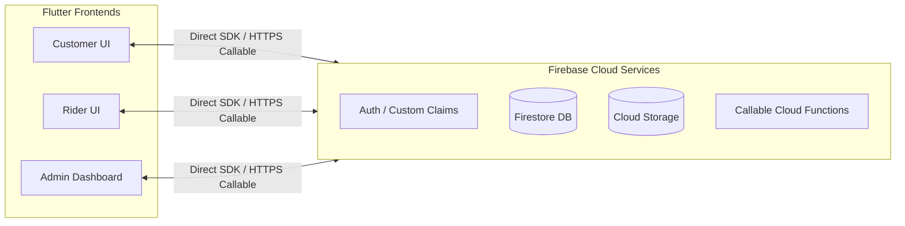
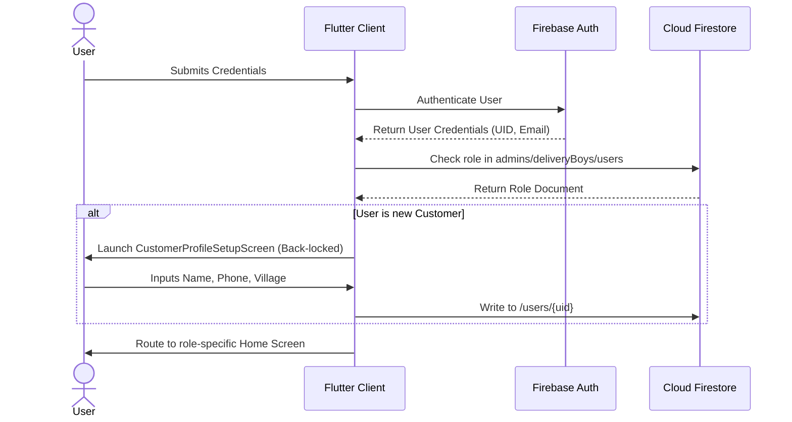
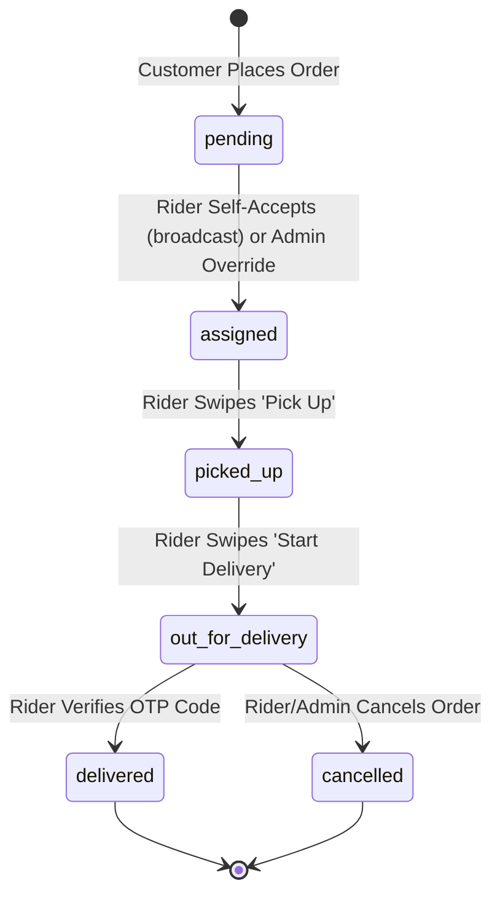

# Software Requirements Specification (SRS)
## For HyperMart (J C Mart) Hyperlocal Commerce Platform

---

## 1. Introduction

### 1.1 Purpose
This document specifies the Software Requirements Specification (SRS) for the **HyperMart** (J C Mart) hyperlocal commerce platform. It describes the scope, functional requirements, non-functional attributes, and interface requirements for the mobile and administrative systems.

### 1.2 Scope
HyperMart is a hyperlocal e-commerce platform designed to serve the **Bhimavaram** service area (including surrounding villages such as Veeravasaram, Rayakuduru, Srungavruksham, and Mentada). The platform enables:
* **Customers** to browse fresh produce, dairy, bakery, snacks, and household products, pin their exact delivery coordinates using an interactive map, and place Cash-on-Delivery (COD) orders.
* **Delivery Partners (Riders)** to view assigned tasks, navigate using external mapping software, progress delivery states using a custom swipe action, and securely close deliveries via a 4-digit One-Time Password (OTP) verification.
* **Administrators** to manage product catalogs, adjust stock counts manually (reconciling physical vs. reserved stock), monitor real-time business statistics, whitelist delivery partners, and monitor/override the automatic broadcast-based rider assignment process.

### 1.3 Definitions, Acronyms, and Abbreviations
* **COD**: Cash on Delivery
* **OTP**: One-Time Password (a secure 4-digit code generated server-side for delivery verification)
* **RBAC**: Role-Based Access Control (enforced via Firebase Custom Claims)
* **UID**: Unique User Identifier (Firebase Authentication identifier)
* **DTO**: Data Transfer Object
* **Logistics Centroid**: Geographic coordinates mapping to the center of a village used as routing fallbacks.
* **Available Stock**: Stock open for purchase (`Physical Stock` - `Reserved Stock`).
* **Reserved Stock**: Stock locked in orders currently in transition (`pending`, `assigned`, `picked_up`, `out_for_delivery`).
* **Physical Stock**: The absolute amount of product inventory present in physical storage.

### 1.4 Overview
The remaining sections details the system's operational constraints, functional system requirements (detailed by user roles), external interfaces, and non-functional requirements (such as security rules, performance indices, and reliability metrics).

---

## 2. Overall Description

### 2.1 Product Perspective
HyperMart operates as a serverless, cross-platform system. It integrates a Flutter client application (targeting iOS, Android, and Web) with a backend powered by Google Firebase (Auth, Firestore, Cloud Functions, and Storage). 

### 2.2 Product Functions
The core capabilities are grouped by user persona:

#### 2.2.1 Customer Functions
* Register via Email or Google Auth.
* Maintain multiple delivery addresses with latitude/longitude coordinates.
* Search and filter product catalogs by category.
* Adjust cart quantities with real-time price summation.
* Place COD orders.
* Access a secure 4-digit OTP for order confirmation.
* Track order progress via a live roadmap stepper.

#### 2.2.2 Delivery Partner Functions
* Authenticate using email credentials matching a whitelisted profile.
* Sync device UID with whitelisted profiles on first-time login.
* Toggle active/on-duty status.
* Receive push-notified broadcasts of new pending orders and self-accept them on a first-come basis (`acceptOrder`).
* View assigned deliveries.
* Launch native mapping apps for destination routing.
* Update order progress states via a Swipe-to-Confirm slider.
* Input customer OTP codes to complete deliveries.

#### 2.2.3 Administrator Functions
* Access dashboard analytics (revenue, active orders, active riders, total catalog size).
* Execute CRUD operations on catalog products.
* Adjust stock counts manually, automatically logging changes to `inventoryLogs`.
* Whitelist, modify, and delete delivery riders.
* Monitor live order-to-rider assignment status (orders are self-accepted by on-duty riders via a broadcast, not manually assigned); override an order's status/rider directly when needed.
* Access the Admin Console itself only after passing a biometric/PIN authentication gate.

### 2.3 User Classes and Characteristics
* **Customers**: Primary consumers. Varying degrees of technical literacy. Require a simplified shopping cart interface, clear pricing structures, and straightforward tracking layouts.
* **Delivery Partners**: On-the-ground riders. Require a highly responsive interface optimized for outdoor usage, high contrast, and easy touch/swipe gestures while driving.
* **Administrators**: Operations managers. Require analytical grids, filterable logs, quick-edit panels, and tools for real-time order monitoring.

### 2.4 Design and Implementation Constraints
1. **Region Restrictions**: To minimize latency in the Bhimavaram target market, Cloud Functions and database queries must run in the **Mumbai region (`asia-south1`)**.
2. **State Management**: Implement pure Provider models (`ChangeNotifier`) to decouple data queries from views.
3. **Database Limitations**: Network read/write frequencies must be managed through client-side optimizations (e.g. `IndexedStack` to cache tab states and avoid redundant query triggers).

### 2.5 Assumptions and Dependencies
* Users possess active internet connections.
* Delivery locations fall within the designated Bhimavaram logistics boundaries.
* Firebase services maintain an uptime of $\ge$ 99.9%.

---

## 3. System Features

### 3.1 Unified Role-Based Authentication & Onboarding
* **Description**: Users sign in via a unified portal. The system detects their registered role and routes them accordingly. Customers are prompted to fill out onboarding details if they lack profile data.
* **Functional Requirements**:
  * The system shall present a TabBar supporting Customer, Delivery, and Admin login states.
  * The customer onboarding screen must hide default navigation buttons to force completion of profile data before accessing the catalog.
  * Customer onboarding must collect: Customer Name (capitalized), mobile number (validated at $\ge$ 10 digits), and village location from a whitelisted dropdown.
  * The system must allow riders to log in only if their email is present in the `/deliveryBoys` whitelist collection.

### 3.2 Hyperlocal Shopping & Catalog Navigation
* **Description**: Customers browse products sorted by category, search by product keywords, and add items to a local shopping cart.
* **Functional Requirements**:
  * Product cards must display the unit size (e.g. "1 kg", "500ml") and unit price.
  * If stock levels drop to 0, product cards must disable addition and display "OUT OF STOCK".
  * Increment/Decrement counters must replace the "ADD" button once an item is added to the cart.
  * A floating checkout summary panel must rise from the bottom navigation bar showing cart items count and total checkout amount if cart items > 0.

### 3.3 Secure Cart, Location Picking & COD Checkout
* **Description**: Customers check out cart items, specify a delivery address, and place an order using the `placeOrder` HTTPS Callable function.
* **Functional Requirements**:
  * The system shall allow users to select from a saved address book or open an interactive Leaflet Map Location Picker (`LeafletLocationPicker`).
  * The checkout process must utilize the HTTPS Callable function `placeOrder` to atomically verify stock and write order records on the server.
  * The `placeOrder` function must execute within an atomic transaction. If stock is insufficient, it must fail without deducting inventory or creating order documents.

### 3.4 Delivery Assignment & Lifecycle Stepper
* **Description**: Orders transition through standard delivery cycles. Rider assignment is a Blinkit-style broadcast: a freshly-placed order is pushed to on-duty riders in its village first (tier 1), widening to every on-duty rider (tier 2) if nobody accepts within `BROADCAST_RETRY_SECONDS` (90s), and re-broadcast on that cadence indefinitely by a scheduled function (`escalateStaleOrders`) until a rider self-accepts via `acceptOrder` — there is deliberately no terminal "give up" state and no admin manual-assign step in the normal flow. Status thereafter progresses via Rider swipe-to-confirm actions, with an Admin override always available.
* **Functional Requirements**:
  * Any on-duty, active rider may claim a `pending`, unassigned order via the `acceptOrder` callable; the transaction is racesafe — the first successful caller wins, others receive a "taken" result.
  * Orders unaccepted for over 90 seconds are automatically re-broadcast to the full on-duty rider pool, escalating from village-matched to area-wide, forever, until accepted.
  * Admins may still directly override an order's status or assigned rider from the console as an escape hatch, but this is not the primary assignment path.
  * The lifecycle flow must enforce sequential transitions: `pending` $\rightarrow$ `assigned` $\rightarrow$ `picked_up` $\rightarrow$ `out_for_delivery` $\rightarrow$ `delivered` / `cancelled`.
  * Riders must progress state changes via a Swipe-to-Confirm slider. A release halfway must snap the slider back to its origin.

### 3.5 Real-time Order Tracking & OTP Verification
* **Description**: Customers track their order status milestones in real time. Deliveries are finalized by matching a secure OTP.
* **Functional Requirements**:
  * The customer's order history and tracking views must display a 4-digit Delivery OTP.
  * Reveal triggers for the OTP must require local biometric validation or passcode entry to protect against accidental disclosure (`BiometricReveal` widget, `lib/core/design/widgets/biometric_reveal.dart`, backed by the `local_auth` package — used on both the Order Success and Order History OTP displays). The OTP itself remains masked behind a "Tap to reveal OTP" control until authentication succeeds; devices with no biometric/PIN configured bypass the gate rather than lock the user out.
  * The delivery boy OTP entry dialog must auto-focus on the next input field as digits are keyed in.
  * The system must restrict OTP verification attempts to 5. Upon exceeding this, the order must be blocked from further verification until manually reviewed by an Admin.
  * Upon successful OTP validation, the order status must transition to `delivered`, physical stock must decrement, and a ledger log must record the sale transaction.

### 3.6 Catalog, Stock, and Inventory Ledger Auditing
* **Description**: Admins manage catalog items, upload assets, and adjust stock counts.
* **Functional Requirements**:
  * The system shall allow Admins to edit product unit prices, description text, units, and images.
  * Admins can adjust stock numbers (adding or subtracting physical stock delta or adjusting reserved locks).
  * Any stock adjustment must write an audit record to `/inventoryLogs` capturing: `productId`, `adminId`, `notes`, `changeType` (`restock`, `correction`, `sale`, `return`), and stock deltas.

### 3.7 Discovery, Post-Delivery, and Support Features
* **Description**: Supplementary customer-facing features layered on top of the core catalog/checkout flow.
* **Functional Requirements**:
  * Customers may search the catalog by keyword (`SearchScreen`), with recent searches persisted locally and debounced query filtering.
  * Customers may favorite products to a Wishlist (`WishlistScreen`), toggled from the product grid or detail page and persisted on their `users/{uid}` profile.
  * The customer home screen displays an admin-managed promotional banner carousel (`BannerCarousel`, admin-authored via `banner_management_screen.dart`).
  * Once an order reaches `delivered`, the customer may submit a single 1-5 star rating (write-once, enforced by `firestore.rules`) and use a one-tap Reorder action that re-adds the order's items to the cart at current price/stock.
  * The Order Tracking screen shows a live "Arriving in Xm" countdown derived from an admin-configured ETA label, and a tap-to-contact-support shortcut (WhatsApp) when the admin has configured a support number.
  * The Rider Task Detail screen offers a tap-to-call "Contact Dispatch" shortcut to the admin-configured support phone number.

### 3.8 Operations Dashboard Stats Aggregation
* **Description**: Background triggers aggregate statistics across active orders, products, and riders to display key metrics in the Admin panel.
* **Functional Requirements**:
  * New orders must automatically increment the `activeOrdersCount` in `config/dashboard_stats`.
  * Transitioning an order to `delivered` must decrement `activeOrdersCount` and increment `completedRevenue` by the order amount.
  * Cancelling an order must trigger a background database transaction to release reserved stock back to available stock.

---

## 4. External Interface Requirements

### 4.1 User Interfaces
* **Client App**: Fully responsive, touch-friendly UI. Must support:
  * Dynamic layout adjustments for different screen sizes (mobile, tablet).
  * High-contrast visibility under direct sunlight (for Riders).
  * Smooth parallax scrolling headers and shimmer loading screens.
* **Admin Dashboard**: Grid-based dashboard. Optimized for web/desktop viewports, featuring data tables, modal popups, and visual statistic charts.

### 4.2 Software Interfaces
* **Database**: Cloud Firestore.
* **Serverless Backend**: Firebase Cloud Functions (Node.js/TypeScript runtime).
* **Map Service**: OpenStreetMap tiles served via Leaflet / FlutterMap package.
* **Location Service**: Geolocator Dart package accessing native Android/iOS GPS hardware.

### 4.3 Communications Interfaces
* Communication between client applications and server systems must occur over HTTPS/TLS secure channels.
* Database triggers and document streams must utilize secure WebSockets for real-time synchronization.

---

## 5. Non-Functional Requirements

### 5.1 Performance Requirements
* **Latency**: The HTTPS Callable functions must complete execution within 2 seconds under standard network conditions.
* **Real-time Syncing**: UI views listening to Firestore collections must reflect database changes within 500 milliseconds.
* **Asset Loading**: Images must be cached locally (`CachedNetworkImage`) to reduce bandwidth consumption.

### 5.2 Safety & Security Requirements
* **Role-Based Security Rules**: Firestore security rules must restrict read/write access based on user claims:
  * Only whitelisted Admins can edit products and access `/inventoryLogs`.
  * Customers can only read/write their own document in `/users` and `/orders`.
  * Riders can only edit status fields of orders assigned to their UID.
* **Data Secrecy**: The 4-digit verification OTP must be stored in a private subcollection `/orders/{orderId}/private/delivery` which is locked down to prevent exposure to anyone other than the ordering customer and backend processes.
* **Authentication Claims**: Custom authentication claims (`admin`, `delivery`) must be assigned and revoked server-side via background event triggers.

### 5.3 Software Quality Attributes
* **Availability**: The system must maintain $\ge$ 99.9% uptime.
* **Reliability**: Transactions must be rollback-safe; network dropouts during checkout or verification must not result in mismatched stock metrics.
* **Maintainability**: The codebase must adhere to Clean Architecture standards, separating Core entities, Data repositories, and UI modules to simplify enhancements.

---

## 6. Database Collections Schema

Refer to the database schema outline below for core document models:

| Collection | Document ID | Key Fields | Description |
| :--- | :--- | :--- | :--- |
| **`users`** | `uid` | `name`, `email`, `phone`, `village`, `addresses` (array), `role: "customer"` | Customer profiles and address books |
| **`deliveryBoys`**| `uid` | `name`, `email`, `phone`, `village`, `isActive`, `role: "delivery"`, `vehicleNo` | Whitelisted rider information |
| **`admins`** | `uid` | `name`, `email`, `phone`, `isActive`, `role: "admin"` | Whitelisted administrator profiles |
| **`products`** | `productId`| `name`, `price`, `physicalStock`, `reservedStock`, `availableStock` | Product catalog and inventory counts |
| **`orders`** | `orderId` | `customerId`, `items` (array), `status`, `totalAmount`, `deliveryBoyId` | Transaction details and states |
| **`inventoryLogs`**| `logId` | `productId`, `adminId`, `changeType`, `physicalDelta`, `reservedDelta` | Audit logs for stock modifications |
